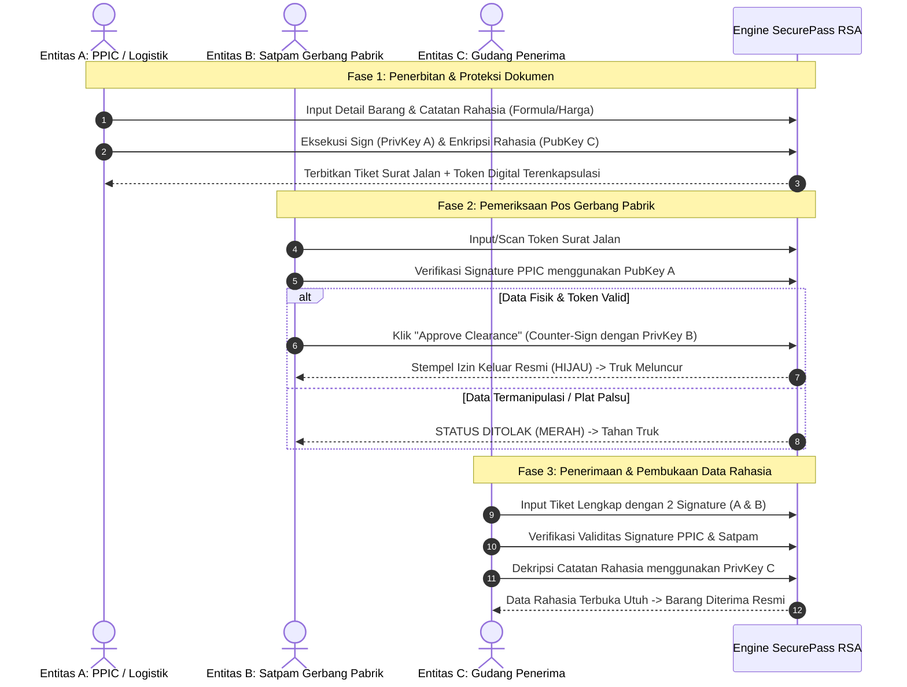

# Product Requirement Document (PRD)
## SecurePass RSA: Sistem Otorisasi & Verifikasi Surat Jalan Barang Keluar-Masuk Pabrik

---

## 1. Ringkasan Eksekutif & Identitas Proyek

* **Nama Produk / Proyek:** `SecurePass RSA` (Digital Gate Pass & Delivery Order Integrity System)
* **Kategori:** Tugas Kriptografi
* **Studi Kasus:** Manajemen Rantai Pasok & Pergudangan (*Warehouse Inbound & Outbound Security*)
* **Anggota Tim:**
  1. **Rayka Dharma Pranandita** — 5027241039 (Math & Cryptographic Engine Specialist)
  2. **Yuan Bany Albyan** — 5027241027 (Security Protocol & FastAPI Backend Specialist)
  3. **Evan Christian Nainggolan** — 5027241026 (Frontend Next.js & Integration Lead)
* **Teknologi Terpilih (Client-Server Architecture):**
  * **Backend API:** Python 3.11+ dengan **FastAPI** + `uvicorn` & `pydantic` (Menjalankan core engine RSA from scratch, 0% library kriptografi).
  * **Frontend Web:** **Next.js (App Router)** + **TypeScript** + **TanStack Query** (`@tanstack/react-query` untuk Client-Side Fetching / CSF & state caching) + **Tailwind CSS**.
  * **Aturan Mutlak:** 0% library kriptografi eksternal di backend maupun frontend (`pycryptodome`, `cryptography`, `crypto-js`, dll. **DILARANG KERAS**). Seluruh fungsi RSA ditulis murni (*from scratch*) di layer backend Python.

---

## 2. Latar Belakang & Masalah (*Problem Statement*)

### 2.1 Masalah Riil Industri Pabrik & Pergudangan
Pada operasional gudang manufaktur, alur barang keluar (*outbound / delivery order*) dan barang masuk (*inbound / receiving*) sangat bergantung pada dokumen fisik **Surat Jalan (Delivery Note / Gate Pass)**. Proses manual ini memiliki celah keamanan kritis:
1. **Manipulasi Data di Tengah Jalan (*Data Tampering*):** Oknum supir truk atau calo mengubah jumlah muatan fisik pada lembar dokumen (misal: 100 karton semen diubah menjadi 80 karton di gerbang pemeriksaan pos satpam untuk menggelapkan 20 karton).
2. **Surat Jalan Fiktif (*Spoofing & Unauthorized Release*):** Pembuatan surat jalan palsu yang meniru kop dan stempel basah perusahaan guna meloloskan armada keluar tanpa persetujuan Manajer Logistik/PPIC.
3. **Ketiadaan Bukti Nir-Sangkalan (*Non-Repudiation*):** Tidak ada bukti kriptografis yang membuktikan siapa pejabat gudang yang secara sah menyetujui pengeluaran muatan bernilai tinggi.

### 2.2 Solusi Berbasis Kriptografi RSA Tingkat Lanjut
`SecurePass RSA` mengimplementasikan arsitektur kriptografi kunci-publik multi-entitas yang mencakup seluruh pilar keamanan informasi:
* **Otentikasi & Anti-Penyangkalan (Digital Signature):** Manajer Gudang/PPIC menandatangani *digest hash* surat jalan menggunakan Kunci Privat $(d_{PPIC}, n_{PPIC})$.
* **Verifikasi Integritas di Gerbang (*Gate Pass Integrity*):** Pos Satpam memvalidasi dokumen secara *air-gapped* menggunakan Kunci Publik $(e_{PPIC}, n_{PPIC})$ sebelum membuka portal pabrik.
* **Persetujuan Bertingkat (*Gate Clearance Counter-Signature*):** Setelah muatan fisik diverifikasi lolos, Satpam membubuhkan tanda tangan digital kedua (*counter-signature*) menggunakan Kunci Privat $(d_{Gate}, n_{Gate})$ sebagai bukti audit bahwa armada resmi diperiksa fisik pada waktu tertentu.
* **Kerahasiaan Muatan Sensitif (*Asymmetric Payload Encryption*):** Data komersial strategis (misal kode batch rahasia, formulasi bahan kimia, harga beli) dienkripsi menggunakan Kunci Publik Gudang Penerima $(e_{Dest}, n_{Dest})$ sehingga pihak ketiga/supir tidak dapat membocorkan informasi selama perjalanan.
* **Visualisasi & Trace Matematis ("Crypto Under the Hood"):** Antarmuka interaktif yang memperlihatkan step-by-step komputasi aritmetika modular (tabel Miller-Rabin, tabel EEA, trace bit Square-and-Multiply, dan chunking data) untuk membuktikan kode murni tanpa library kriptografi.
---

## 3. Komparasi Studi Kasus: Logistik Umum vs. Barang Keluar-Masuk Pabrik

| Parameter Evaluasi | Logistik Ekspedisi Umum | Barang Keluar-Masuk Gudang / Pabrik (*Terpilih*) |
| :--- | :--- | :--- |
| **Ruang Lingkup Masalah** | Terlalu luas (melibatkan GPS, tracking kurir, rute, resi konsumen, multi-drop point). | **Fokus & Terarah** (fokus pada validitas dokumen gerbang pos & integritas muatan). |
| **Kesesuaian dengan RSA** | Banyak fitur logistik yang tidak relevan dengan esensi RSA (tracking armada, peta). | **100% Selaras** dengan esensi *Digital Signature, Authentication, Non-repudiation, & Secrecy*. |
| **Kekuatan Skenario Demo** | Sering terlihat seperti aplikasi toko online / ekspedisi tiruan. | **Sangat Realistis & Kuat:** Mudah mendemokan skenario serangan pemalsuan jumlah barang di depan dosen/video. |
| **Beban Implementasi UI** | Butuh banyak halaman antarmuka (profil penerima, estimasi ongkir, timeline). | **Padat & Efisien:** Dashboard Admin Gudang (Penerbitan) dan Dashboard Pos Keamanan (Verifikasi). |

**Keputusan:** Mengambil **Barang Keluar dan Masuk Pabrik / Pergudangan (*SecurePass RSA*)**.

---

## 4. Landasan Teknis Matematika RSA (*From Scratch*)

Semua fungsi berikut diimplementasikan murni tanpa modul kriptografi bawaan:

```
+---------------------------------------------------------------------------------+
|                                CORE ENGINE RSA                                  |
+---------------------------------------------------------------------------------+
| 1. Prime Generator & Primality Test (Miller-Rabin / Trial Division)             |
| 2. Greatest Common Divisor (Euclidean Algorithm): gcd(a, b)                    |
| 3. Extended Euclidean Algorithm (EEA): Menghitung invers modular d = e^(-1) mod phi |
| 4. Modular Exponentiation: Square-and-Multiply / Binary Exponentiation          |
| 5. Chunking / Blocking: Representasi teks -> blok integer mi < n                |
| 6. Hashing Mandiri (Simple Custom Hash / FNV-1a / DJB2 / Polynomial Rolling)    |
+---------------------------------------------------------------------------------+
```

### 4.1 Pembangkitan Bilangan Prima
* Fungsi `is_prime(n, k=5)` menggunakan algoritma probabilistik **Miller-Rabin** (atau deterministik untuk rentang tertentu) guna menjamin pembangkitan prima $p$ dan $q$ berukuran aman untuk simulasi edukasi (misal: prima 16-bit hingga 32-bit untuk demonstrasi cepat tanpa lag komputasi).

### 4.2 Perhitungan Kunci
1. $n = p \times q$
2. $\phi(n) = (p - 1) \times (q - 1)$
3. Pemilihan $e$: Memenuhi $1 < e < \phi(n)$ dan $\gcd(e, \phi(n)) = 1$ (umumnya mencoba $e = 65537$ atau bilangan prima kecil ganjil yang coprime).
4. Pemilihan $d$: Menghitung nilai $d$ menggunakan `extended_euclidean(e, phi_n)` sehingga $(d \times e) \equiv 1 \pmod{\phi(n)}$.

### 4.3 Eksponensiasi Modular Cepat (*Square-and-Multiply*)
* Menghitung $m^e \pmod n$ dan $c^d \pmod n$ secara manual untuk mencegah terjadinya *overflow* memori:
  $$\text{mod\_exp}(base, exp, mod)$$
  dengan kompleksitas waktu $\mathcal{O}(\log(exp))$.

### 4.4 Chunking & Encoding
* Pesan teks dikonversi ke urutan ASCII / UTF-8 byte.
* Membagi byte menjadi blok $m_i$ sedemikian rupa sehingga $m_i < n$.
* Setiap blok dienkripsi/didekripsi lalu digabungkan kembali secara konsisten.

---

## 5. Fitur & Kebutuhan Fungsional Diperluas (*Expanded Functional Requirements*)

### 5.1 Modul 1: Manajemen Kunci Multi-Entitas (*Multi-Party Key Lifecycle*)
* **FR-1.1 Tiga Pasang Kunci Entitas Riil:**
  1. **Entitas A — PPIC / Manajer Logistik:** Kunci $(e_A, n_A)$ & $(d_A, n_A)$ untuk penerbitan dan penandatanganan surat jalan.
  2. **Entitas B — Pos Satpam Gerbang Pabrik (*Security Gate*):** Kunci $(e_B, n_B)$ & $(d_B, n_B)$ untuk pembubuhan *Gate Clearance Counter-Signature*.
  3. **Entitas C — Gudang Penerima (*Destination Warehouse*):** Kunci $(e_C, n_C)$ & $(d_C, n_C)$ untuk dekripsi manifest catatan rahasia.
* **FR-1.2 Pembangkitan Kunci Fleksibel:**
  * Pembangkitan otomatis bilangan prima acak (16-bit hingga 32-bit untuk demonstrasi cepat tanpa lag komputasi).
  * Opsi input manual nilai $p, q, e$ untuk pengujian akademik sesuai contoh modul kuliah ($p=47, q=71, e=79$).
* **FR-1.3 Validasi Parameter Transparan:** Uji keprimaan otomatis ($p \neq q$), pengecekan $\gcd(e, \phi(n)) = 1$, dan kalkulasi invers modular $d$.

### 5.2 Modul 2: Step-by-Step Crypto Inspector / Debugger ("Under the Hood")
*(Fitur khusus pembuktian implementasi manual tanpa library eksternal)*
* **FR-2.1 Visualisasi Uji Miller-Rabin:** Menampilkan rincian dekomposisi $n-1 = 2^s \cdot d$, basis pengujian $a$, perhitungan modular, dan status saksi keprimaan per putaran.
* **FR-2.2 Tabel Extended Euclidean Algorithm (EEA):** Menampilkan tabel langkah mundur pembagian modular untuk membuktikan pencarian nilai $d$ dari persamaan $e \cdot d \equiv 1 \pmod{\phi(n)}$.
* **FR-2.3 Trace Eksponensiasi Modular (*Square-and-Multiply*):** Menampilkan representasi biner eksponen serta operasi *SQUARE* dan *MULTIPLY* baris-demi-baris pada kalkulasi blok tertentu.
* **FR-2.4 Visualisasi Chunking/Blocking:** Memperlihatkan transformasi dari string teks $\rightarrow$ byte ASCII/UTF-8 $\rightarrow$ blok integer numerik $m_i < n \rightarrow$ ciphertext blok $c_i$.

### 5.3 Modul 3: Penerbitan Surat Jalan (*Issuing & Multi-Layer Cryptography*)
* **FR-3.1 Formulir Manifest Operasional:** Input Dokumen ID, Tipe (`INBOUND` / `OUTBOUND`), Data Armada (Plat Truk, Supir), Rincian Barang (SKU, Nama, Qty, Satuan), Timestamp, dan Catatan Sensitif.
* **FR-3.2 Pembuatan Digital Signature PPIC:** Menghitung digest hash manifest secara mandiri, lalu menandatanganinya dengan Kunci Privat PPIC $(d_A, n_A)$:
  $$\text{Signature}_A = (\text{Hash})^d \pmod n$$
* **FR-3.3 Enkripsi Asimetris Catatan Sensitif:** Mengenkripsi catatan khusus (misal formula bahan baku / harga) dengan Kunci Publik Penerima $(e_C, n_C)$ sehingga aman dari supir dan pihak luar.
* **FR-3.4 Self-Contained Token Export (Air-Gapped Package):** Menghasilkan paket data terenkapsulasi (format JSON Base64 atau QR Code) yang dapat diverifikasi tanpa koneksi jaringan terpusat.

### 5.4 Modul 4: Pos Verifikasi Gerbang & Counter-Signing (*Security Gatekeeper*)
* **FR-4.1 Verifikasi Integritas & Otentikasi Primer:**
  * Petugas gerbang memasukkan paket token surat jalan.
  * Sistem memverifikasi tanda tangan menggunakan Kunci Publik PPIC $(e_A, n_A)$.
  * Jika valid, rincian fisik muatan ditampilkan di layar satpam untuk inspeksi fisik.
* **FR-4.2 Counter-Signature Clearance Gerbang:**
  * Setelah inspeksi fisik sesuai, satpam menekan tombol *"Approve Gate Clearance"*.
  * Sistem membubuhkan tanda tangan digital kedua menggunakan Kunci Privat Satpam $(d_B, n_B)$ bersama stempel waktu keluar (*Departure Timestamp*).

### 5.5 Modul 5: Konfirmasi Penerimaan Gudang Tujuan (*Receiving & Decryption*)
* **FR-5.1 Verifikasi Ganda (*Dual Verification*):** Gudang penerima memverifikasi keaslian surat jalan dari PPIC dan stempel izin gerbang dari Satpam.
* **FR-5.2 Dekripsi Catatan Sensitif:** Gudang penerima menggunakan Kunci Privat $(d_C, n_C)$ miliknya untuk membuka manifest rahasia yang terenkripsi.

### 5.6 Modul 6: Laboratorium Simulasi Serangan (*Cryptographic Attack Suite*)
*(Sarana demonstrasi interaktif untuk video presentasi YouTube)*
* **FR-6.1 Skenario Serangan 1 — *Payload Tampering Attack*:** Pengguna memanipulasi jumlah barang (misal: 100 sak diubah jadi 80 sak) atau mengubah nomor plat truk $\rightarrow$ Hash berubah $\rightarrow$ Verifikasi Gagal (**MERAH / DATA TERMANIPULASI**).
* **FR-6.2 Skenario Serangan 2 — *Impersonation / Rogue Signer Attack*:** Surat jalan ditandatangani menggunakan Kunci Privat penyerang (bukan PPIC resmi) $\rightarrow$ Verifikasi dengan Kunci Publik PPIC menghasilkan hash tidak valid $\rightarrow$ Ditolak (**MERAH / PENANDATANGAN PALSU**).
* **FR-6.3 Skenario Serangan 3 — *Signature Corruption Attack*:** Memanipulasi 1 karakter token tanda tangan digital $\rightarrow$ Dekripsi signature menghasilkan integer rusak $\rightarrow$ Ditolak (**MERAH / TANDA TANGAN RUSAK**).
* **FR-6.4 Skenario Serangan 4 — *Replay Attack Simulation*:** Mencoba meloloskan token surat jalan yang masa berlakunya telah usai atau token yang sudah berstatus *Dispatched* sebelumnya $\rightarrow$ Sistem mendeteksi *Token Reuse* $\rightarrow$ Ditolak (**KUNING / EXPIRED OR REPLAYED TOKEN**).

### 5.7 Modul 7: Log Jejak Audit Kriptografis (*Cryptographic Audit Trail*)
* **FR-7.1 Riwayat Verifikasi:** Mencatat setiap percobaan verifikasi (waktu, dokumen ID, aktor, status valid/tampered, dan nilai hash pembanding).
---

## 6. Kebutuhan Non-Fungsional (*Non-Functional Requirements*)

* **NFR-1 Kepatuhan Akademik (Zero External Crypto Lib):** 
  * Wajib 100% bebas dari `Crypto.PublicKey`, `cryptography.hazmat`, dll.
  * Seluruh perhitungan aritmetika modular ditulis dalam modul `rsa_core.py`.
* **NFR-2 Performa:** 
  * Pembangkitan kunci dan proses sign/verify harus selesai di bawah 2 detik untuk demonstrasi tanpa lagging.
* **NFR-3 Responsivitas UI:** 
  * Tampilan antarmuka modern, intuitif, menyajikan visualisasi step-by-step proses matematika (sangat memikat untuk nilai laporan).
* **NFR-4 Dokumentasi Kode:** 
  * Setiap fungsi wajib memiliki docstring matematis lengkap (rumus, parameter input, return value).

---

## 7. Desain Data & Skema Dokumen

### 7.1 Skema Data Surat Jalan Multi-Entitas (`GatePassPackage`)
```json
{
  "doc_id": "SJ-OUT-202410-089",
  "doc_type": "OUTBOUND",
  "timestamp": "2024-10-06T14:30:00Z",
  "nonce": "a7f92e8c",
  "valid_until": "2024-10-06T18:00:00Z",
  "issuer_entity": "PPIC_MANUFACTURING",
  "truck": {
    "plate_number": "B 9812 UXZ",
    "driver_name": "Budi Santoso"
  },
  "destination_entity": "WAREHOUSE_REGIONAL_WEST",
  "items": [
    {"sku": "SMN-50KG", "name": "Semen Portland 50kg", "qty": 100, "unit": "sak"},
    {"sku": "BTO-01KG", "name": "Aditif Beton Super", "qty": 10, "unit": "pail"}
  ],
  "security": {
    "digest_hash": 48291,
    "issuer_signature": "1082-0301-2986",
    "gate_clearance": {
      "cleared_at": "2024-10-06T15:02:10Z",
      "officer_id": "GUARD-04",
      "counter_signature": "0543-1198-2104"
    },
    "encrypted_confidential_payload": "03280301265329861164"
  }
}
```

---

## 8. Alur Pengguna (*User Flow*)



---

## 9. Struktur Kode Program (*Project Directory Architecture*)

```text
rsa-warehouse-gatepass/
├── backend/
│   ├── core/
│   │   ├── __init__.py
│   │   ├── math_utils.py       # gcd, extended_euclidean, mod_inverse, mod_exp
│   │   ├── primes.py           # trial division, miller-rabin prime test & generator
│   │   ├── inspector.py        # tracer step-by-step: EEA table, square-multiply trace
│   │   ├── rsa_engine.py       # keygen, rsa_encrypt, rsa_decrypt, sign, verify
│   │   └── hashing.py          # manual checksum / polynomial hash generator
│   ├── models/
│   │   ├── __init__.py
│   │   └── schemas.py          # Pydantic schemas (GatePassPackage, API payloads)
│   ├── routers/
│   │   ├── keygen_router.py    # POST /api/v1/keys/generate, /validate
│   │   ├── inspect_router.py   # POST /api/v1/inspect/eea, /modexp, /miller-rabin
│   │   ├── pass_router.py      # POST /api/v1/pass/issue, /gate-verify, /receive
│   │   └── attack_router.py    # POST /api/v1/attack/simulate
│   ├── main.py                 # FastAPI application & CORS configuration
│   └── requirements.txt        # fastapi, uvicorn, pydantic (NO CRYPTO LIB)
├── frontend/
│   ├── src/
│   │   ├── app/
│   │   │   ├── layout.tsx      # Root layout with TanStack Query Provider
│   │   │   ├── page.tsx        # Dashboard landing overview
│   │   │   ├── keygen/page.tsx # Multi-entity keygen management
│   │   │   ├── inspector/page.tsx # Visualisasi step-by-step crypto debugger
│   │   │   ├── issue/page.tsx  # Form PPIC issue gate pass & primary sign
│   │   │   ├── gate/page.tsx   # Pos satpam check & counter-signing
│   │   │   ├── receiving/page.tsx # Pos penerima cabang & decrypt secret memo
│   │   │   └── attack-lab/page.tsx # 4 skenario simulasi serangan siber
│   │   ├── components/         # Reusable UI cards, tables, badge, QR viewer
│   │   ├── hooks/              # Custom TanStack Query hooks (useKeygen, useInspect, etc.)
│   │   ├── lib/api.ts          # API Client fetcher terpusat
│   │   └── types/api.ts        # TypeScript interfaces matching backend schemas
│   ├── package.json            # Next.js, React, @tanstack/react-query, tailwindcss
│   └── tsconfig.json
├── data/samples/               # Contoh manifest JSON & sample keys
├── docs/LAPORAN_TUGAS.docx     # Dokumen Word laporan tugas wajib
└── README.md
```

---

## 10. Rencana Pengujian untuk Demo Video YouTube

| Skenario | Langkah Pengujian | Hasil yang Diharapkan | Bukti Penilaian Kriptografi |
| :--- | :--- | :--- | :--- |
| **TC-01: Keygen & Math Inspector** | Buka tab Inspector, generate kunci 3 entitas, lihat trace langkah Miller-Rabin & tabel EEA. | Parameter $p, q, n, \phi(n), e, d$ dan trace operasi modular terpampang transparan. | Bukti nyata algoritma manual *from scratch*. |
| **TC-02: Complete Lifecycle (Happy Path)** | PPIC menerbitkan surat jalan + sign $\rightarrow$ Satpam verifikasi & counter-sign $\rightarrow$ Penerima verifikasi ganda & dekripsi catatan rahasia. | Status beruntun **VALID** di semua pos, data rahasia berhasil didekripsi dengan Kunci Privat C. | Membuktikan integrasi *Signature*, *Counter-Signature*, dan *Asymmetric Encryption*. |
| **TC-03: Attack 1 — Payload Tampering** | Ubah jumlah barang dari 100 menjadi 80 sak pada tiket. Klik verifikasi gerbang. | Status **MERAH (HASH MISMATCH / DATA TERMANIPULASI)**. | Membuktikan sifat *Integrity*. |
| **TC-04: Attack 2 — Rogue Signer** | Tanda tangani tiket menggunakan Kunci Privat palsu. Verifikasi dengan Kunci Publik resmi PPIC. | Status **MERAH (INVALID SIGNATURE / PEMALSUAN DOKUMEN)**. | Membuktikan sifat *Authentication & Non-repudiation*. |
| **TC-05: Attack 3 — Signature Corruption** | Ubah 1 karakter pada token signature heksadesimal. Verifikasi di gerbang. | Status **MERAH (CORRUPTED SIGNATURE / MATH FAILED)**. | Membuktikan ketahanan matematis RSA terhadap degradasi bit. |
| **TC-06: Attack 4 — Replay / Expired Attack** | Masukkan kembali token tiket yang sudah pernah berstatus *Dispatched* atau lewat masa berlaku. | Status **KUNING/MERAH (REPLAY ATTACK DETECTED)**. | Membuktikan keamanan protokol terhadap replay muatan. |
---

## 11. Pembagian Tugas Kelompok (3 Orang)

Agar pembagian kerja seimbang dan masing-masing anggota memiliki kontribusi nyata saat presentasi perkenalan diri (Nama & NRP) di video YouTube serta laporan Word, berikut pembagian perannya:

* **Rayka Dharma Pranandita (5027241039) — Core Cryptographic & Math Engine Specialist:**
  * Implementasi modul matematika dasar dari nol (`math_utils.py`, `primes.py`):
    * Pembangkitan bilangan prima acak dan pengujian keprimaan (*Miller-Rabin* / *Trial Division*).
    * Perhitungan $\gcd(a, b)$ dan *Extended Euclidean Algorithm (EEA)* untuk mencari invers modular $d$.
    * Algoritma *Modular Exponentiation* (*Square-and-Multiply*) dengan pencegahan *overflow*.
  * Modul `inspector.py`: Logging dan pengeksposan trace komputasi per langkah (tabel EEA dan trace bit eksponen).
  * Bukti perhitungan manual angka kecil untuk bab laporan Word.

* **Yuan Bany Albyan (5027241027) — Security Protocol, Multi-Party Pipeline & FastAPI Backend:**
  * Implementasi modul protokol data (`hashing.py`, `rsa_engine.py`):
    * Logika *Encoding/Decoding* dan *Blocking/Chunking* teks menjadi blok integer $m_i < n$ serta penggabungan kembali.
    * Implementasi fungsi digest hash dokumen dari nol.
    * Pembuatan alur tanda tangan primer (*PPIC Sign*), tanda tangan sekunder (*Gate Counter-Sign*), dan enkripsi/dekripsi payload rahasia (*Confidential Memo Encryption*).
    * Penanganan pencegahan *replay attack* (nonce/timestamp validation) & serialisasi token Base64/JSON.
  * Pembangunan REST API Backend dengan **FastAPI** (`backend/routers/` & `backend/models/schemas.py`).

* **Evan Christian Nainggolan (5027241026) — Frontend Next.js (TypeScript), TanStack Query & Integration Lead:**
  * Perancangan antarmuka modern Web SPA/SSR menggunakan **Next.js (App Router)** dan **TypeScript**:
    * Integrasi **TanStack Query** (`@tanstack/react-query`) untuk Client-Side Fetching (CSF), caching, status loading/error, dan mutations.
    * Pembuatan 6 halaman fungsional: Dashboard, Key Management, Crypto Inspector, Issue Gate Pass, Gate Clearance, Receiving Point, dan Attack Lab Suite.
  * Integrasi komunikasi frontend $\leftrightarrow$ FastAPI backend (`src/lib/api.ts`).
  * Sutradara video presentasi YouTube (pembagian sesi bicara per anggota, demo interaktif) dan kompilasi laporan Word (`.docx`).
