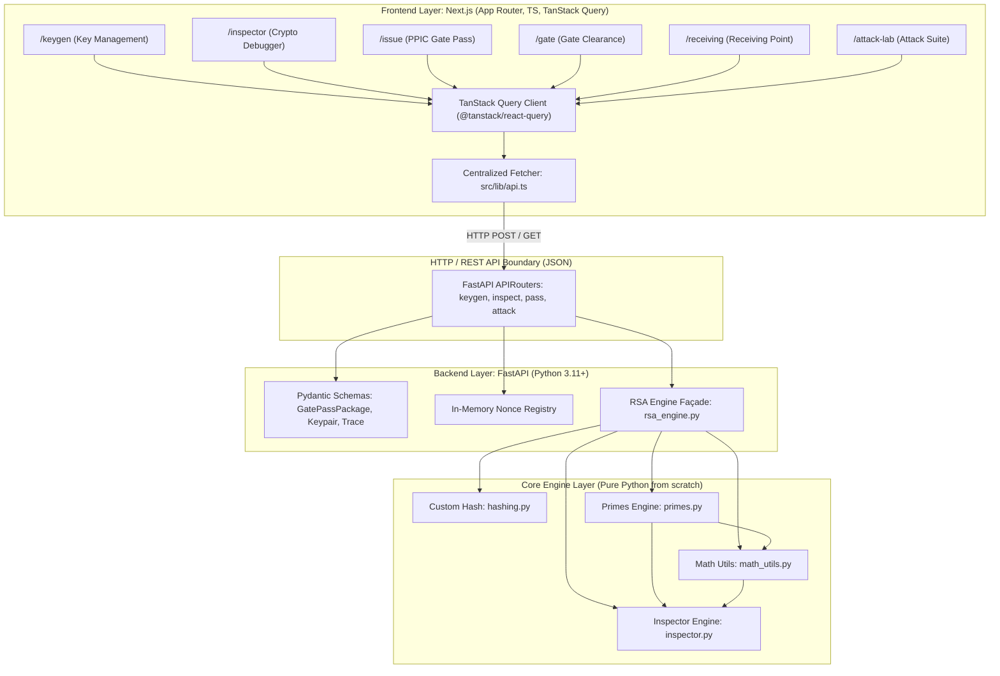
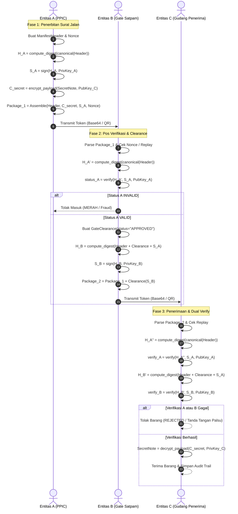

# Technical Design Document: SecurePass RSA

- **Proyek**: SecurePass RSA — Sistem Otorisasi & Verifikasi Surat Jalan Barang Keluar-Masuk Pabrik
- **Versi Dokumen**: 1.0.0
- **Tanggal**: 6 Oktober 2024
- **Dokumen Terkait**:
  - PRD: [02-prd-securepass-rsa.md](./02-prd-securepass-rsa.md)
  - Task & Rencana Kerja: [04-task-roadmap.md](./04-task-roadmap.md)

---

## 1. Header & Ringkasan Eksekutif

SecurePass RSA adalah sistem verifikasi dan otorisasi clearance surat jalan pabrik berbasis kriptografi kunci publik RSA murni (*0% cryptographic libraries*). Sistem ini mengintegrasikan rantai otorisasi tiga pihak (*three-party approval chain*), proteksi kerahasiaan catatan logistik sensitif (*confidential payload encryption*), audit trail kriptografis dengan inspeksi internal algoritma (*crypto inspector*), serta modul simulasi eksploitasi (*Attack Lab Suite*).

---

## 2. Arsitektur Sistem

Sistem dirancang menggunakan arsitektur **Client-Server Terpisah (*Decoupled RESTful Architecture*)**:
1. **Frontend Web**: Dibangun menggunakan **Next.js (App Router)** + **TypeScript** + **TanStack Query** (`@tanstack/react-query` untuk Client-Side Fetching / CSF & state mutations) + **Tailwind CSS**.
2. **Backend API**: Dibangun menggunakan Python 3.11+ **FastAPI** + `uvicorn` & `pydantic` yang mengelola routing, validasi skema request/response, dan anti-replay registry.
3. **Core Engine**: Seluruh logika matematika RSA, pengujian prima, invers modular, eksponensiasi modular, custom hashing, dan blocking diimplementasikan manual 100% dari nol (*0% external crypto library*).

### 2.1 Diagram Layer Sistem



### 2.2 Aliran Data Antar Layer (Client-Side Fetching / CSF Flow)
1. **User Action (Browser)**: Pengguna berinteraksi dengan antarmuka Next.js (mengisi form surat jalan, menekan tombol *Generate Prime*, atau memilih skenario serangan).
2. **TanStack Query Mutation/Query**: Komponen React memanggil custom hook (misal: `useMutation({ mutationFn: issueGatePass })`). TanStack Query mengelola status `isPending`, `isError`, `data`, dan `error` secara reaktif di sisi client.
3. **REST API Transmission**: `src/lib/api.ts` mengirim payload JSON ke FastAPI endpoint (misal: `http://localhost:8000/api/v1/pass/issue`).
4. **Pydantic Validation**: FastAPI memvalidasi tipe data masukan menggunakan model Pydantic pada `backend/models/schemas.py`.
5. **Core Computation**: Router memanggil modul `rsa_engine.py` (yang menggunakan `math_utils.py`, `primes.py`, `hashing.py`, dan `inspector.py`).
6. **Response & Cache Update**: Hasil kalkulasi RSA dikembalikan sebagai response JSON. TanStack Query memperbarui state client dan memicu re-render UI secara instan.
---

## 3. Arsitektur Kriptografi Multi-Entitas

Sistem memodelkan alur bisnis rantai pasok dengan tiga entitas yang memiliki pasangan kunci RSA masing-masing:

```
[ Entitas A: PPIC ]          [ Entitas B: Satpam Gerbang ]       [ Entitas C: Gudang Penerima ]
KeyPair: (e_A, n_A), (d_A, n_A)  KeyPair: (e_B, n_B), (d_B, n_B)     KeyPair: (e_C, n_C), (d_C, n_C)
       │                                     │                                    │
       ├─ 1. Sign Manifest (PrivKey A)       │                                    │
       ├─ 2. Encrypt Secret (PubKey C)       │                                    │
       │                                     │                                    │
       └─────────── Transmit Token ─────────>│                                    │
                                             ├─ 3. Verify Manifest (PubKey A)     │
                                             ├─ 4. Counter-Sign (PrivKey B)       │
                                             │                                    │
                                             └────────── Transmit Token ─────────>│
                                                                                  ├─ 5. Verify Sign A (PubKey A)
                                                                                  ├─ 6. Verify Sign B (PubKey B)
                                                                                  └─ 7. Decrypt Secret (PrivKey C)
```

### 3.1 Peran dan Operasi Kriptografi Tiap Entitas

| Entitas | Nama Role | Kunci Privat / Publik | Operasi Kriptografi yang Dilakukan |
| :--- | :--- | :--- | :--- |
| **Entitas A** | PPIC / Manajer Logistik | $K_{pr,A} = (d_A, n_A)$<br>$K_{pub,A} = (e_A, n_A)$ | • **Signing Manifest**: Menghitung hash manifest $H_A$, membuat digital signature $S_A = (H_A)^{d_A} \pmod{n_A}$.<br>• **Enkripsi Catatan Sensitif**: Enkripsi plaintext $M$ dengan PubKey C: $C = M^{e_C} \pmod{n_C}$. |
| **Entitas B** | Satpam Gerbang Pabrik | $K_{pr,B} = (d_B, n_B)$<br>$K_{pub,B} = (e_B, n_B)$ | • **Verifikasi Manifest A**: Mengecek $S_A^{e_A} \pmod{n_A} \stackrel{?}{=} H_A$.<br>• **Counter-Signing Clearance**: Menghitung hash clearance gabungan $H_B$, membuat signature $S_B = (H_B)^{d_B} \pmod{n_B}$. |
| **Entitas C** | Gudang Penerima / Audit | $K_{pr,C} = (d_C, n_C)$<br>$K_{pub,C} = (e_C, n_C)$ | • **Dual Verification**: Memverifikasi validitas $S_A$ dengan $K_{pub,A}$ dan validitas $S_B$ dengan $K_{pub,B}$.<br>• **Dekripsi Catatan Sensitif**: Dekripsi ciphertext $C$ dengan PrivKey C: $M = C^{d_C} \pmod{n_C}$. |

### 3.2 Rumus Matematis RSA

1. **Pembentukan Kunci (*Key Generation*)**:
   $$n = p \cdot q, \quad \phi(n) = (p - 1)(q - 1)$$
   $$\gcd(e, \phi(n)) = 1 \quad (1 < e < \phi(n))$$
   $$d \equiv e^{-1} \pmod{\phi(n)} \iff e \cdot d \equiv 1 \pmod{\phi(n)}$$

2. **Enkripsi dan Dekripsi Pesan Ter-blok (*Chunked Encryption*)**:
   $$C_i \equiv M_i^{e_C} \pmod{n_C}, \quad M_i \equiv C_i^{d_C} \pmod{n_C} \quad (0 \le M_i < n_C)$$

3. **Digital Signature & Verifikasi**:
   $$H = \text{Hash}(Payload)$$
   $$S \equiv H^d \pmod n$$
   $$H' \equiv S^e \pmod n$$
   $$\text{Status} = \begin{cases} \text{VALID}, & \text{jika } H' == H \\ \text{INVALID}, & \text{jika } H' \neq H \end{cases}$$

---

## 4. Spesifikasi Modul Core Engine

Setiap modul diimplementasikan murni menggunakan Python native tanpa `cryptography`, `rsa`, `pycryptodome`, maupun `gmpy2`.

### 4.1 `core/primes.py`
Menangani pengujian keprimaan, pencarian bilangan prima acak, dan faktorisasi verifikasi.

- **Konstanta & Parameter Rekomendasi**:
  - Ukuran bit demo/edukasi: 16–32 bit (dapat difaktorisasi & di-trace cepat di UI).
  - Ukuran bit operasional minimum: 64–128 bit.
  - Batas Miller-Rabin rounds ($k$): 20–40 iterasi acak.

- **Signatures**:
  ```python
  def is_prime_trial_division(n: int, limit: int = 10000) -> bool: ...
  def miller_rabin(n: int, k: int = 20, inspector_cb: callable | None = None) -> bool: ...
  def generate_prime_candidate(bits: int) -> int: ...
  def generate_prime(bits: int, inspector_cb: callable | None = None) -> int: ...
  ```

- **Pseudocode Algoritma**:
  - *Trial Division*:
    ```
    function is_prime_trial_division(n, limit):
        if n < 2: return False
        if n in (2, 3): return True
        if n % 2 == 0 or n % 3 == 0: return False
        i = 5
        while i * i <= n and i <= limit:
            if n % i == 0 or n % (i + 2) == 0:
                return False
            i += 6
        return True
    ```
  - *Miller-Rabin*:
    ```
    function miller_rabin(n, k):
        if n < 2: return False
        if n in (2, 3): return True
        if n % 2 == 0: return False
        write n - 1 = 2^s * d with d odd
        repeat k times:
            a = random_integer in range [2, n - 2]
            x = (a^d) mod n
            if x == 1 or x == n - 1:
                continue
            composite = True
            for r from 1 to s - 1:
                x = (x^2) mod n
                if x == n - 1:
                    composite = False
                    break
            if composite:
                return False
        return True
    ```

- **Contoh Output**:
  ```python
  generate_prime(16) -> 43579
  miller_rabin(43579, k=5) -> True
  ```

---

### 4.2 `core/math_utils.py`
Menangani algoritma Euclidean, Extended Euclidean Algorithm, modular inverse, dan eksponensiasi modular.

- **Signatures**:
  ```python
  def gcd(a: int, b: int) -> int: ...
  def extended_euclidean(a: int, b: int, trace_hook: callable | None = None) -> tuple[int, int, int]: ...
  def mod_inverse(e: int, phi: int, trace_hook: callable | None = None) -> int: ...
  def mod_exp(base: int, exp: int, mod: int, trace_hook: callable | None = None) -> int: ...
  ```

- **Extended Euclidean Algorithm**:
  - Mengembalikan `(g, x, y)` sedemikian sehingga $a \cdot x + b \cdot y = g = \gcd(a, b)$.
  - Trace hook mencatat baris tabel: `step, q, r, x, y`.

- **Square-and-Multiply (Binary Exponentiation)**:
  - Mengonversi `exp` ke biner: $b_k b_{k-1} \dots b_0$.
  - Inisialisasi: `result = 1`.
  - Untuk setiap bit dari MSB ke LSB:
    - *Square*: `result = (result * result) % mod`
    - *Multiply* (jika bit == 1): `result = (result * base) % mod`

- **Contoh Trace Square-and-Multiply**:
  $3^{13} \pmod{17}$: Eksponen $13 = (1101)_2$.
  | Step | Bit | Operasi | Formula | Hasil Sementara |
  | :--- | :--- | :--- | :--- | :--- |
  | Init | - | Start | $R = 1$ | 1 |
  | 1 | 1 | Square & Multiply | $(1^2 \cdot 3) \pmod{17}$ | 3 |
  | 2 | 1 | Square & Multiply | $(3^2 \cdot 3) \pmod{17} = 27 \pmod{17}$ | 10 |
  | 3 | 0 | Square only | $(10^2) \pmod{17} = 100 \pmod{17}$ | 15 |
  | 4 | 1 | Square & Multiply | $(15^2 \cdot 3) \pmod{17} = (4 \cdot 3) \pmod{17}$ | 12 |

  Hasil akhir: $3^{13} \equiv 12 \pmod{17}$.

---

### 4.3 `core/inspector.py`
Merekam jejak komputasi secara transparan untuk ditampilkan pada UI Inspector / Debugger.

- **Struktur Data**:
  ```python
  from dataclasses import dataclass, field
  from typing import Any

  @dataclass
  class StepTrace:
      step_number: int
      operation: str
      details: dict[str, Any]

  @dataclass
  class ExecutionReport:
      algorithm_name: str
      input_params: dict[str, Any]
      output_result: Any
      steps: list[StepTrace] = field(default_factory=list)
  ```

- **Interface Inspector**:
  ```python
  class CryptoInspector:
      def __init__(self):
          self.reports: list[ExecutionReport] = []

      def start_trace(self, algorithm_name: str, input_params: dict) -> None: ...
      def record_step(self, operation: str, details: dict) -> None: ...
      def end_trace(self, output_result: Any) -> ExecutionReport: ...
  ```

- **Format Output Tabel**:
  - *Tabel EEA*: `{"step": i, "q": q, "r1": r1, "r2": r2, "r": r, "x1": x1, "x2": x2, "x": x, "y1": y1, "y2": y2, "y": y}`
  - *Bit Trace ModExp*: `{"bit_index": idx, "bit_value": bit, "op": "Square/Multiply", "prev_val": p, "new_val": n}`

---

### 4.4 `core/hashing.py`
Fungsi hash deterministik custom dari nol (*Polynomial Rolling Hash with prime base and modulus*).

- **Formula**:
  $$H(s) = \left( \sum_{i=0}^{L-1} \text{ord}(s[i]) \cdot p^i \right) \pmod m$$
  Di mana $p = 313$ (bilangan prima), $m = 2^{31} - 1 = 2147483647$ (Mersenne prime $M_{31}$).

- **Signatures**:
  ```python
  def polynomial_hash(text: str, base: int = 313, mod: int = 2147483647) -> int: ...
  def compute_digest(payload: str) -> int: ...
  def canonical_json_digest(data: dict) -> int: ...
  ```

- **Contoh**:
  `text = "HELLO"`
  - `'H' (72) * 313^0 = 72`
  - `'E' (69) * 313^1 = 21597`
  - `'L' (76) * 313^2 = 7445716`
  - `'L' (76) * 313^3 = 2330509108 = 183025461 mod 2147483647`
  - `'O' (79) * 313^4 ...`
  - Hash value deterministik integer: misal `1842958102`.

---

### 4.5 `core/rsa_engine.py`
Façade engine kriptografi RSA tingkat tinggi.

- **Signatures**:
  ```python
  def generate_keypair(bits: int = 32, e: int = 65537, inspector: CryptoInspector | None = None) -> tuple[tuple[int, int], tuple[int, int]]: ...
  # Returns: ((e, n), (d, n))

  def rsa_encrypt(message_int: int, pub_key: tuple[int, int], inspector: CryptoInspector | None = None) -> int: ...
  def rsa_decrypt(cipher_int: int, priv_key: tuple[int, int], inspector: CryptoInspector | None = None) -> int: ...

  def text_to_blocks(text: str, n: int) -> list[int]: ...
  def blocks_to_text(blocks: list[int]) -> str: ...

  def encrypt_payload(plaintext: str, pub_key: tuple[int, int], inspector: CryptoInspector | None = None) -> list[int]: ...
  def decrypt_payload(cipher_blocks: list[int], priv_key: tuple[int, int], inspector: CryptoInspector | None = None) -> str: ...

  def sign(digest: int, priv_key: tuple[int, int], inspector: CryptoInspector | None = None) -> int: ...
  def verify(digest: int, signature: int, pub_key: tuple[int, int], inspector: CryptoInspector | None = None) -> bool: ...
  ```

- **Aturan Chunking**:
  Jika representasi integer dari chunk $\ge n$, chunking memotong per 1–2 karakter (sesuai panjang bit $n$). Ukuran byte chunk $B = \max(1, \lfloor \frac{\text{bit\_length}(n) - 1}{8} \rfloor)$.

---

## 5. Spesifikasi Model Data (`models/gate_pass.py`)

Struktur domain menggunakan Python `dataclass` terstruktur untuk mendukung audit trail dan serialisasi lossless.

```python
from dataclasses import dataclass, field, asdict
from typing import Optional
import json

@dataclass
class SecurityLayer:
    algorithm: str = "RSA-Custom-Scratch"
    hash_algorithm: str = "Polynomial-Rolling-Hash-313"
    key_size_bits_a: int = 32
    key_size_bits_b: int = 32
    key_size_bits_c: int = 32

@dataclass
class ManifestHeader:
    pass_id: str                   # Format: SP-YYYYMMDD-XXXX
    timestamp: str                 # ISO-8601 UTC
    valid_until: str               # ISO-8601 UTC
    issuer_entity: str             # "Entity-A-PPIC"
    origin: str
    destination: str
    vehicle_plate: str
    driver_name: str
    item_list: list[dict]          # [{"sku": "SKU-01", "name": "Besi Baja", "qty": 100}]

@dataclass
class GateClearance:
    gate_id: str                   # "GATE-OUT-01"
    inspector_id: str              # "SAT-B-042"
    timestamp_inspected: str       # ISO-8601 UTC
    status: str                    # "APPROVED" / "REJECTED"
    counter_signature: Optional[int] = None

@dataclass
class GatePassPackage:
    security: SecurityLayer
    header: ManifestHeader
    encrypted_secret: list[int]    # Ciphertext catatan rahasia untuk Entitas C
    primary_signature: int         # Tanda tangan digital Entitas A
    clearance: Optional[GateClearance] = None
    nonce: str = ""                # Anti-replay unique string (UUID/Hex)

    def to_dict(self) -> dict:
        return asdict(self)

    @classmethod
    def from_dict(cls, data: dict) -> "GatePassPackage":
        header = ManifestHeader(**data["header"])
        security = SecurityLayer(**data["security"])
        clearance = GateClearance(**data["clearance"]) if data.get("clearance") else None
        return cls(
            security=security,
            header=header,
            encrypted_secret=data["encrypted_secret"],
            primary_signature=data["primary_signature"],
            clearance=clearance,
            nonce=data["nonce"]
        )
```

---

## 6. Protokol Kriptografi End-to-End

### 6.1 Diagram Sequence



### 6.2 Alur Rinci Langkah Kriptografis
1. **Fase 1 (Penerbitan)**:
   - Data masukan disusun menjadi format kanonikal: $D_{\text{manifest}}$.
   - $H_A = \text{polynomial\_hash}(D_{\text{manifest}})$.
   - $S_A = (H_A)^{d_A} \pmod{n_A}$ via `sign(H_A, priv_key_A)`.
   - Pesan sensitif $M_{\text{secret}}$ di-chunk dan dienkripsi: $C_i = (M_i)^{e_C} \pmod{n_C}$ via `encrypt_payload(secret, pub_key_C)`.
   - Objek `GatePassPackage` diserialisasi ke JSON lalu Base64.
2. **Fase 2 (Gate Clearance)**:
   - Base64 di-decode menjadi objek paket.
   - Periksa apakah `nonce` telah tercatat di `NonceRegistry` dan apakah `timestamp <= valid_until`.
   - Hitung ulang $H_A' = \text{polynomial\_hash}(D_{\text{manifest}})$.
   - Verifikasi $S_A$: hitung $V_A = (S_A)^{e_A} \pmod{n_A}$. Jika $V_A == H_A'$, verifikasi primer VALID.
   - Buat clearance record $D_{\text{clearance}}$.
   - Hitung digest clearance gabungan: $H_B = \text{polynomial\_hash}(D_{\text{manifest}} + D_{\text{clearance}} + \text{str}(S_A))$.
   - Buat counter-signature satpam: $S_B = (H_B)^{d_B} \pmod{n_B}$ via `sign(H_B, priv_key_B)`.
   - Update paket dengan clearance data dan $S_B$.
3. **Fase 3 (Penerimaan Gudang)**:
   - Verifikasi primer $S_A$ dengan $K_{pub,A}$.
   - Verifikasi sekunder $S_B$ dengan $K_{pub,B}$.
   - Jika kedua tanda tangan valid, lakukan dekripsi catatan sensitif: $M_i = (C_i)^{d_C} \pmod{n_C}$ via `decrypt_payload(C_secret, priv_key_C)`.
   - Tampilkan plaintext catatan logistik kepada petugas gudang.

---

## 7. Protokol Anti-Replay

Untuk mencegah serangan penggunaan token bekas (*replay attack*), sistem mengimplementasikan mekanisme validasi ganda:

### 7.1 Nonce Registry & Lifespan Validation
- **Struktur Registry**:
  ```python
  class NonceRegistry:
      def __init__(self):
          # Format: {nonce_hex: {"pass_id": str, "used_at": str, "stage": str}}
          self._used_nonces: dict[str, dict] = {}

      def is_replayed(self, nonce: str) -> bool:
          return nonce in self._used_nonces

      def register(self, nonce: str, pass_id: str, stage: str) -> None:
          self._used_nonces[nonce] = {
              "pass_id": pass_id,
              "used_at": datetime.utcnow().isoformat(),
              "stage": stage
          }
  ```
- **Validasi `valid_until`**:
  Waktu sistem lokal dibandingkan terhadap atribut ISO-8601 `valid_until`. Jika $T_{\text{current}} > T_{\text{valid\_until}}$, paket ditolak dengan error `EXPIRED_PASS`.
- **Edge Cases**:
  1. *Clock skew*: Diberikan toleransi toleran ambang batas waktu (grace period) 60 detik.
  2. *Duplicate Submission*: Token yang di-scan dua kali pada pos satpam langsung memicu status peringatan `REPLAY_ATTACK_DETECTED`.

---

## 8. Spesifikasi Serialisasi Token

### 8.1 Format JSON Kanonikal
```json
{
  "security": {
    "algorithm": "RSA-Custom-Scratch",
    "hash_algorithm": "Polynomial-Rolling-Hash-313",
    "key_size_bits_a": 32,
    "key_size_bits_b": 32,
    "key_size_bits_c": 32
  },
  "header": {
    "pass_id": "SP-20241006-0001",
    "timestamp": "2024-10-06T08:00:00Z",
    "valid_until": "2024-10-06T18:00:00Z",
    "issuer_entity": "Entity-A-PPIC",
    "origin": "Pabrik Utama Cikarang",
    "destination": "Gudang Distribusi Karawang",
    "vehicle_plate": "B 9876 XYZ",
    "driver_name": "Budi Santoso",
    "item_list": [
      {"sku": "RAW-001", "name": "Biji Tembaga", "qty": 500}
    ]
  },
  "encrypted_secret": [18293012, 9481920, 203912],
  "primary_signature": 84729103,
  "clearance": null,
  "nonce": "a7f4e92b-88c9-4b4d-b94f-f3e1a0c4921b"
}
```

### 8.2 Encoding & QR Code
- JSON diurutkan kuncinya (*sorted keys* tanpa indentasi):
  `compact_json = json.dumps(data, sort_keys=True, separators=(',', ':'))`
- Dikodekan ke Base64 UTF-8:
  `token_base64 = base64.b64encode(compact_json.encode('utf-8')).decode('ascii')`
- **Generasi QR Code**:
  - Frontend Next.js merender QR Code menggunakan library ringan React seperti `react-qr-code` atau `@techstark/opencv-js` / HTML5 Canvas (hanya untuk tampilan grafis, bukan komputasi kripto).

### 8.3 Spesifikasi Kontrak REST API (FastAPI Backend)
Seluruh pertukaran data antara Next.js dan FastAPI dilakukan melalui endpoint berikut:

| Method | Endpoint | Fungsi | Request Body | Response Body |
| :--- | :--- | :--- | :--- | :--- |
| `POST` | `/api/v1/keys/generate` | Pembangkitan kunci otomatis | `{"bits": 32, "entity": "A"}` | `{"pub_key": [e, n], "priv_key": [d, n], "p": p, "q": q, "phi": phi}` |
| `POST` | `/api/v1/keys/validate` | Validasi kunci manual $p, q, e$ | `{"p": 47, "q": 71, "e": 79}` | `{"valid": true, "n": 3337, "phi": 3220, "d": 1019, "msg": "OK"}` |
| `POST` | `/api/v1/inspect/trace` | Eksekusi trace algoritma | `{"algorithm": "eea", "params": {...}}` | `{"algorithm": "eea", "steps": [...], "result": ...}` |
| `POST` | `/api/v1/pass/issue` | PPIC menerbitkan & sign | `{"manifest": {...}, "priv_key_a": [...], "pub_key_c": [...]}` | `{"token_base64": "...", "package": {...}}` |
| `POST` | `/api/v1/pass/gate-verify` | Satpam cek integritas | `{"token_base64": "...", "pub_key_a": [...]}` | `{"valid": true, "manifest": {...}, "is_replayed": false}` |
| `POST` | `/api/v1/pass/gate-clearance`| Satpam counter-sign | `{"token_base64": "...", "priv_key_b": [...], "officer_id": "..."}` | `{"updated_token_base64": "...", "clearance": {...}}` |
| `POST` | `/api/v1/pass/receive` | Cabang verify & decrypt | `{"token_base64": "...", "pub_key_a": [...], "pub_key_b": [...], "priv_key_c": [...]}` | `{"valid_a": true, "valid_b": true, "decrypted_secret": "..."}` |
| `POST` | `/api/v1/attack/simulate` | Lab simulasi exploit | `{"attack_type": "tamper", "token_base64": "...", "modifications": {...}}` | `{"status": "TAMPERED", "error_code": "HASH_MISMATCH", "details": {...}}` |

---

## 9. Desain Frontend Web (Next.js App Router & TanStack Query)

Antarmuka pengguna diatur menjadi navigasi modern Next.js App Router dengan Client-Side Fetching (CSF) via TanStack Query.

### 9.1 `src/app/keygen/page.tsx`
- **Komponen**: Card pemilih entitas (A: PPIC, B: Satpam, C: Gudang), dropdown ukuran bit, input form manual $p, q, e$, tombol "Generate Random Prime", tombol "Hitung Keypair", badges status parameter.
- **TanStack Query Hooks**:
  - `useMutation({ mutationFn: api.generateKeypair })`
  - `useMutation({ mutationFn: api.validateKeypair })`
- **State Client**: `activeEntity`, `keyCache` (disimpan pada React Context / Zustand / LocalStorage agar persisten antar-tab).
```
+-------------------------------------------------------------+
| [Tab: Key Management]                                       |
| Pilih Entitas: (o) PPIC [A]    ( ) Gate [B]    ( ) Gudang [C]|
|-------------------------------------------------------------|
| Bit Size: [32-bit v]  [ Acak Prime p & q ]                  |
| p: [ 43579 ]          q: [ 49999 ]                          |
| e: [ 65537 ]          [ Validasi & Hitung Pasangan Kunci ]   |
|-------------------------------------------------------------|
| Public Key (e, n):  (65537, 2178906421)                     |
| Private Key (d, n): (1284719201, 2178906421)                |
| Status Parameter:   VALID (gcd(e, phi)=1, p & q prima)       |
+-------------------------------------------------------------+
```

### 9.2 `inspector_view.py`
- **Komponen**: Selector algoritma (Miller-Rabin / EEA / ModExp / Chunking), input debugger, tombol "Eksekusi Trace", tabel rincian iterasi langkah per langkah.
- **Wireframe**:
```
+-------------------------------------------------------------+
| [Tab: Crypto Inspector & Debugger]                          |
| Algoritma: [ Extended Euclidean Algorithm v ]               |
| Input A: [ 65537 ]      Input B (phi): [ 2178812844 ]       |
| [ Jalankan Trace Inspeksi ]                                 |
|-------------------------------------------------------------|
| Step |  q   |  r1  |  r2  |  r   |  x1  |  x2  |  x   |  y... |
|------+------+------+------+------+------+------+------+------|
| 1    | 3324 | ...  | ...  | ...  | ...  | ...  | ...  | ...  |
| 2    | 1    | ...  | ...  | ...  | ...  | ...  | ...  | ...  |
| Output: gcd=1, Inverse=1284719201                            |
+-------------------------------------------------------------+
```

### 9.3 `issue_view.py`
- **Komponen**: Form surat jalan (ID, Driver, Truk, Item SKU & Qty), input teks catatan sensitif (rahasia), tombol "Sign & Terbitkan", display Base64 Token & QR Code view.
- **Wireframe**:
```
+-------------------------------------------------------------+
| [Tab: Penerbitan Surat Jalan (PPIC)]                        |
| ID: [SP-20241006-0001]  Truk: [B 9876 XYZ] Driver: [Budi]   |
| Manifest Barang:                                            |
| [ RAW-001 | Biji Tembaga | 500 kg ]                         |
| Catatan Sensitif (Di-enkripsi untuk Gudang C):               |
| [ Kode brankas kontainer: #SEC-9912 ]                       |
| [ Sign dengan PrivKey A & Enkripsi dengan PubKey C ]        |
|-------------------------------------------------------------|
| Token Terbit (Base64): [ eyJhbGciOiJSU0EtQ3VzdG9tI... ]     |
| [ Salin Token ]   [ Tampilkan / Ekspor QR Code ]            |
+-------------------------------------------------------------+
```

### 9.4 `gate_view.py`
- **Komponen**: Input text Base64 / upload token, tombol "Verifikasi Manifest A", banner visual Status (HIJAU/MERAH), tombol "Counter-Sign Satpam", ekspor token updated.
- **Wireframe**:
```
+-------------------------------------------------------------+
| [Tab: Pos Gerbang Satpam]                                   |
| Masukkan Token Masuk: [ Paste Base64 / Scan QR ]             |
| [ Lakukan Verifikasi Manifest A ]                           |
|-------------------------------------------------------------|
| STATUS: [ >>> HIJAU: TANDA TANGAN ASLI & VALID <<< ]        |
| Manifest Terverifikasi: Truk B 9876 XYZ, Driver Budi         |
| Status Nonce: FRESH (Belum pernah dipakai)                  |
| [ Counter-Sign & Setujui Clearance (PrivKey B) ]            |
| Token Ter-update: [ eyJhbGciOiJSU0EtQ2xlYXJhbmNl... ]        |
+-------------------------------------------------------------+
```

### 9.5 `receiving_view.py`
- **Komponen**: Input token akhir, tombol "Verifikasi Dual Signature (A+B)", tombol "Buka & Dekripsi Catatan Sensitif", panel hasil catatan terbuka.
- **Wireframe**:
```
+-------------------------------------------------------------+
| [Tab: Gudang Penerima]                                      |
| Masukkan Token Final: [ Paste Base64 ]                      |
| [ Verifikasi Rantai Clearance (A & B) ]                     |
|-------------------------------------------------------------|
| Tanda Tangan A (PPIC):   [ VALID / AUTHENTIC ]              |
| Tanda Tangan B (Satpam): [ VALID / APPROVED ]               |
| [ Dekripsi Catatan Rahasia dengan PrivKey C ]               |
| Hasil Dekripsi: "Kode brankas kontainer: #SEC-9912"         |
+-------------------------------------------------------------+
```

### 9.6 `attack_lab_view.py`
- **Komponen**: Tombol preset skenario 1–4, editor token interaktif, tombol "Uji Serangan", konsol deteksi eksploitasi.
- **Wireframe**:
```
+-------------------------------------------------------------+
| [Tab: Attack Lab Suite]                                     |
| Pilih Simulasi Serangan:                                    |
| [ 1. Payload Tamper ] [ 2. Rogue Signer ]                   |
| [ 3. Corrupt Sign   ] [ 4. Replay Attack ]                  |
| Payload Token di Lapangan:                                  |
| [ "item_list": [{"sku": "RAW-001", "qty": 999999}] ]        |
| [ Eksekusi Verifikasi Terhadap Payload Terdistorsi ]        |
|-------------------------------------------------------------|
| LOG DETEKSI:                                                |
| [PERINGATAN KRITIS] Digest Tidak Cocok!                      |
| Expected Digest: 1842958102, Computed Digest: 981249120      |
| Hasil: VERIFIKASI DITOLAK (TAMPERING DETECTED)              |
+-------------------------------------------------------------+
```

---

## 10. Alur Data Attack Lab

| Skenario Serangan | Input yang Dimodifikasi | Titik Kegagalan Fungsi | Output / Tampilan ke Pengguna |
| :--- | :--- | :--- | :--- |
| **1. Payload Tampering** | Mengubah kuantitas muatan pada JSON token (misal: 100 unit $\to$ 999 unit). | `verify(new_digest, orig_sig, pub_key_A)` | Banner **MERAH**: `VERIFICATION_FAILED: Hash mismatch. Manipulasi isi manifest terdeteksi!` |
| **2. Rogue Signer** | Tanda tangan dibuat menggunakan kunci privat lain $K_{pr,X}$, mengklaim sebagai PPIC. | `verify(digest, rogue_sig, pub_key_A)` | Banner **MERAH**: `INVALID_SIGNATURE: Dekripsi tanda tangan dengan PubKey A tidak menghasilkan digest manifest.` |
| **3. Signature Corruption** | Mengubah beberapa digit pada integer `primary_signature` (bit-flip). | `verify(digest, corrupt_sig, pub_key_A)` | Banner **MERAH**: `SIGNATURE_CORRUPTED: Nilai signature rusak secara matematis.` |
| **4. Replay Attack** | Mengirimkan kembali token surat jalan yang sudah pernah disetujui / kedaluwarsa. | `nonce_registry.is_replayed(nonce)` atau perbandingan waktu `valid_until` | Banner **MERAH**: `REPLAY_ATTACK_DETECTED: Token dengan Nonce ini sudah pernah diproses pada <Timestamp>.` |

---

## 11. Konvensi Kode & Standardisasi

1. **Naming Convention**:
   - Fungsi dan variabel: `snake_case` (contoh: `mod_inverse`, `generate_keypair`).
   - Class dan Dataclass: `PascalCase` (contoh: `GatePassPackage`, `CryptoInspector`).
   - Konstanta: `UPPER_SNAKE_CASE` (contoh: `DEFAULT_PRIME_BITS`, `MERSENNE_31`).
2. **Type Hints**:
   - Seluruh deklarasi fungsi wajib memiliki anotasi tipe parameter dan nilai balik secara ketat (`int`, `str`, `tuple[int, int]`, `Optional[GateClearance]`).
3. **Docstrings**:
   - Menggunakan format Google Style Docstrings lengkap dengan `Args:`, `Returns:`, dan `Raises:`.
4. **Error Handling Pattern**:
   - Untuk operasi matematika kritis: raise custom exceptions (`ModularInverseError`, `InvalidParameterError`).
   - Untuk validasi alur kriptografi pada pipeline façade: kembalikan tuple eksplisit `tuple[bool, str]` (contoh: `(True, "Verification successful")` atau `(False, "Signature mismatch")`).

---

## 12. Dependency & Import Map

Arsitektur modul menetapkan batas impor yang jelas agar UI tidak bergantung langsung pada rincian algoritma matematika dasar:

```
ui/views/*.py
   │
   ├─► core/rsa_engine.py  (Façade utama)
   ├─► core/inspector.py   (Untuk visualisasi debugger)
   └─► models/gate_pass.py (Untuk parsing domain object)

core/rsa_engine.py
   │
   ├─► core/primes.py
   ├─► core/math_utils.py
   ├─► core/hashing.py
   └─► core/inspector.py

core/primes.py
   │
   ├─► core/math_utils.py
   └─► core/inspector.py

core/math_utils.py
   │
   └─► core/inspector.py
```

### Tabel Rangkuman Dependensi:
| Modul Pemanggil | Diizinkan Mengimpor | Dilarang Mengimpor | Alasan |
| :--- | :--- | :--- | :--- |
| `ui/views/*` | `core.rsa_engine`, `core.inspector`, `models.gate_pass` | `core.math_utils`, `core.primes`, `core.hashing` | Mempertahankan abstraksi façade; UI hanya berbicara ke orchestrator tingkat tinggi. |
| `core/rsa_engine.py` | `core.math_utils`, `core.primes`, `core.hashing`, `core.inspector` | Seluruh modul di `ui/` | Core Engine wajib independen dari antarmuka pengguna grafis. |
| `core/math_utils.py` | `core.inspector` (opsional via callback) | Modul mana pun di luar dirinya | Math library merupakan primitive murni mandiri. |
