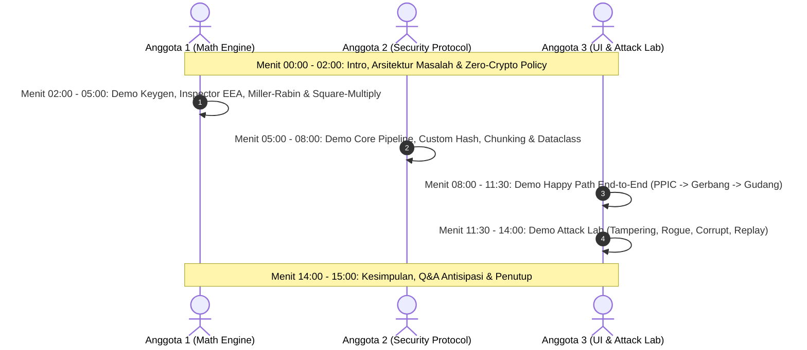

# Task Breakdown & Implementation Roadmap
## Proyek: SecurePass RSA — Sistem Otorisasi & Verifikasi Surat Jalan Pabrik

- **Dokumen Terkait**: [PRD](./02-prd-securepass-rsa.md) | [System Design & Architecture](./03-technical-design.md)
- **Kategori**: Tugas Kriptografi
- **Anggota Kelompok**:
  - **Rayka Dharma Pranandita** — 5027241039 (Role 1: Math Engine & Inspector)
  - **Yuan Bany Albyan** — 5027241027 (Role 2: Security Protocol & FastAPI Backend)
  - **Evan Christian Nainggolan** — 5027241026 (Role 3: Frontend Next.js & TanStack Query Lead)
- **Tech Stack**:
  - **Backend**: Python 3.11+, **FastAPI**, `uvicorn`, `pydantic` (0% Library Kriptografi Eksternal)
  - **Frontend**: **Next.js (App Router)**, **TypeScript**, **TanStack Query** (`@tanstack/react-query` untuk Client-Side Fetching / CSF & state caching), **Tailwind CSS**
---

## 1. Status Board & Ringkasan Task

### ROLE 1 — Math Engine & Inspector Specialist: Rayka Dharma Pranandita (5027241039)
| ID | Task | Assignee | Priority | Status | Est. Jam |
| :--- | :--- | :--- | :---: | :---: | :---: |
| `TASK-1.1` | Implementasi `is_prime()` Trial Division | Rayka | 🔴 High | ☐ Todo | 2h |
| `TASK-1.2` | Implementasi Miller-Rabin Primality Test `miller_rabin(n, k)` | Rayka | 🔴 High | ☐ Todo | 4h |
| `TASK-1.3` | Implementasi `generate_prime(bit_length)` Random Prime Generator | Rayka | 🔴 High | ☐ Todo | 3h |
| `TASK-1.4` | Implementasi `gcd(a, b)` Euclidean Algorithm | Rayka | 🔴 High | ☐ Todo | 1h |
| `TASK-1.5` | Implementasi `extended_euclidean(a, b)` (return gcd, x, y) | Rayka | 🔴 High | ☐ Todo | 3h |
| `TASK-1.6` | Implementasi `mod_inverse(e, phi_n)` via EEA | Rayka | 🔴 High | ☐ Todo | 2h |
| `TASK-1.7` | Implementasi `mod_exp(base, exp, mod)` Square-and-Multiply | Rayka | 🔴 High | ☐ Todo | 3h |
| `TASK-1.8` | Implementasi `keygen(bit_length, e_manual=None)` | Rayka | 🔴 High | ☐ Todo | 3h |
| `TASK-1.9` | Implementasi `inspector.py` (Trace Logger Miller-Rabin, EEA, ModExp) | Rayka | 🟡 Med | ☐ Todo | 5h |
| `TASK-1.10` | Unit Test Manual & Verifikasi Contoh Kuliah ($p=47, q=71, e=79$) | Rayka | 🟡 Med | ☐ Todo | 2h |

### 🔒 ROLE 2 — Security Protocol & FastAPI Backend Specialist: Yuan Bany Albyan (5027241027)
* **Fokus Utama**: Protokol keamanan data, hashing manual, blocking/chunking, digital signature, enkripsi payload, serialisasi token, anti-replay, serta pembuatan endpoint REST API **FastAPI**.
* **File Kepemilikan**: `backend/core/hashing.py`, `backend/core/rsa_engine.py`, `backend/models/schemas.py`, `backend/routers/*.py`.

| ID | Task | Assignee | Priority | Status | Est. Jam |
| :--- | :--- | :--- | :---: | :---: | :---: |
| `TASK-2.1` | Implementasi `custom_hash(data_str)` Polynomial Rolling Hash | Yuan | 🔴 High | ☐ Todo | 3h |
| `TASK-2.2` | Implementasi Chunking `text_to_blocks()` & `blocks_to_text()` | Yuan | 🔴 High | ☐ Todo | 4h |
| `TASK-2.3` | Implementasi `rsa_encrypt()` & `rsa_decrypt()` Core Engine | Yuan | 🔴 High | ☐ Todo | 3h |
| `TASK-2.4` | Implementasi `sign(manifest_str, priv_key_A)` Digital Signature | Yuan | 🔴 High | ☐ Todo | 3h |
| `TASK-2.5` | Implementasi `verify(manifest_str, signature_blocks, pub_key_A)` | Yuan | 🔴 High | ☐ Todo | 3h |
| `TASK-2.6` | Implementasi `counter_sign(clearance_str, priv_key_B)` Satpam | Yuan | 🔴 High | ☐ Todo | 2h |
| `TASK-2.7` | Implementasi `encrypt_payload()` & `decrypt_payload()` PrivKey/PubKey C | Yuan | 🔴 High | ☐ Todo | 3h |
| `TASK-2.8` | Implementasi `serialize_token(gate_pass_obj)` (JSON + Base64) | Yuan | 🟡 Med | ☐ Todo | 2h |
| `TASK-2.9` | Implementasi `deserialize_token(token_str)` (Base64 + JSON) | Yuan | 🟡 Med | ☐ Todo | 2h |
| `TASK-2.10` | Implementasi Anti-Replay Mechanism (Nonce Registry & Timestamp) | Yuan | 🟡 Med | ☐ Todo | 2h |
| `TASK-2.11` | Implementasi Pydantic Dataclass Model di `models/schemas.py` | Yuan | 🟢 Low | ☐ Todo | 2h |
| `TASK-2.12` | Implementasi REST API Routers FastAPI (`keygen`, `inspect`, `pass`, `attack`) | Yuan | 🔴 High | ☐ Todo | 4h |

### 💻 ROLE 3 — Frontend Next.js (TypeScript) & TanStack Query Lead: Evan Christian Nainggolan (5027241026)
* **Fokus Utama**: Seluruh tampilan antarmuka web modern menggunakan Next.js App Router, TypeScript, integrasi data via TanStack Query (CSF), interactive attack lab suite, rekaman video YouTube, dan perakitan laporan Word.
* **File Kepemilikan**: `frontend/src/app/`, `frontend/src/components/`, `frontend/src/hooks/`, `frontend/src/lib/api.ts`.

| ID | Task | Assignee | Priority | Status | Est. Jam |
| :--- | :--- | :--- | :---: | :---: | :---: |
| `TASK-3.1` | Setup Next.js App Router, QueryClientProvider, Layout & Navbar | Evan | 🔴 High | ☐ Todo | 3h |
| `TASK-3.2` | `keygen/page.tsx`: UI 3 Entitas + TanStack Mutation Key Generation | Evan | 🟡 Med | ☐ Todo | 4h |
| `TASK-3.3` | `inspector/page.tsx`: UI Crypto Debugger (EEA, ModExp, Miller-Rabin) | Evan | 🟡 Med | ☐ Todo | 5h |
| `TASK-3.4` | `issue/page.tsx`: Form PPIC Manifest + TanStack Mutation Issue Pass | Evan | 🔴 High | ☐ Todo | 4h |
| `TASK-3.5` | `gate/page.tsx`: Pos Satpam Gate Clearance + Counter-Signing Mutation | Evan | 🔴 High | ☐ Todo | 4h |
| `TASK-3.6` | `receiving/page.tsx`: Dual Verify & Decrypt Secret Memo Mutation | Evan | 🔴 High | ☐ Todo | 4h |
| `TASK-3.7` | `attack-lab/page.tsx`: 4 Interactive Cyber Attack Scenarios UI | Evan | 🔴 High | ☐ Todo | 5h |
| `TASK-3.8` | Setup `src/lib/api.ts` Client Fetcher & TypeScript Interfaces | Evan | 🔴 High | ☐ Todo | 3h |
| `TASK-3.9` | Audit Trail Real-time Log & LocalStorage Key Cache Synchronization | Evan | 🟢 Low | ☐ Todo | 2h |
| `TASK-3.10` | Penyusunan Data Sample JSON di `data/samples/` | Evan | 🟢 Low | ☐ Todo | 1h |
### Bersama (Semua Anggota)
| ID | Task | Assignee | Priority | Status | Est. Jam |
| :--- | :--- | :--- | :---: | :---: | :---: |
| `TASK-0.1` | Inisialisasi Repository Git & Folder Scaffold | Semua | 🔴 High | ☐ Todo | 1h |
| `TASK-0.2` | Penyusunan `requirements.txt` & Enforce Virtual Environment | Semua | 🔴 High | ☐ Todo | 0.5h |
| `TASK-0.3` | Skeleton Entry Point `main.py` & Smoke Test Import | Semua | 🔴 High | ☐ Todo | 1h |
| `TASK-4.1` | Eksekusi TC-01 s/d TC-06 End-to-End Validation | Semua | 🔴 High | ☐ Todo | 4h |
| `TASK-4.2` | Rekaman Demo & Produksi Video YouTube | Semua | 🔴 High | ☐ Todo | 4h |
| `TASK-4.3` | Penyusunan Laporan Akhir Word (.docx) & Bukti Manual Hitungan | Semua | 🔴 High | ☐ Todo | 6h |

---

## 2. Phase 0: Setup & Scaffolding (Semua Anggota)

### [TASK-0.1] Inisialisasi Repository Git & Struktur Monorepo (Backend + Frontend)
- **Assignee**: Semua (Lead: Anggota 3)
- **Estimasi**: 1 jam | **Priority**: 🔴 High | **Dependency**: Tidak ada
- **Deskripsi**: Menyiapkan repositori Git lokal dan remote, membuat branch default `main` dan `dev`, serta membuat kerangka folder proyek terpisah: `backend/` dan `frontend/`.
- **Acceptance Criteria**:
  - [ ] Folder terbuat: `backend/core/`, `backend/models/`, `backend/routers/`, `frontend/src/app/`, `data/samples/`, `tests/`.
  - [ ] File `.gitignore` terkonfigurasi untuk Python (`__pycache__/`, `.venv/`) dan Node.js (`node_modules/`, `.next/`).
  - [ ] Branch proteksi disepakati: tidak push langsung ke `main`, gunakan feature branches.

### [TASK-0.2] Penyusunan `requirements.txt` & `package.json`
- **Assignee**: Semua (Lead: Anggota 2 & Anggota 3)
- **Estimasi**: 0.5 jam | **Priority**: 🔴 High | **Dependency**: TASK-0.1
- **Deskripsi**: Menetapkan dependency minimal:
  - Backend: `fastapi>=0.110.0`, `uvicorn>=0.28.0`, `pydantic>=2.6.0` (**0% crypto lib**).
  - Frontend: `next>=15.0.0`, `react`, `@tanstack/react-query>=5.0.0`, `tailwindcss`, `lucide-react`.
- **Acceptance Criteria**:
  - [ ] `pip install -r backend/requirements.txt` sukses pada virtual environment Python 3.11+.
  - [ ] `npm install` (atau `pnpm install`) sukses pada direktori `frontend/`.

### [TASK-0.3] Skeleton Entry Points & CORS Setup
- **Assignee**: Semua (Lead: Anggota 3 & Anggota 2)
- **Estimasi**: 1 jam | **Priority**: 🔴 High | **Dependency**: TASK-0.1, TASK-0.2
- **Deskripsi**: Membuat file `backend/main.py` (FastAPI instance dengan `CORSMiddleware` aktif untuk `http://localhost:3000`) dan skeleton `frontend/src/app/page.tsx` dengan TanStack Query Provider.
- **Acceptance Criteria**:
  - [ ] Perintah `uvicorn backend.main:app --reload` membuka API Docs di `http://localhost:8000/docs`.
  - [ ] Perintah `npm run dev` membuka Next.js di `http://localhost:3000` tanpa error.
  - [ ] Tes ping/healthcheck dari frontend ke backend mengembalikan status HTTP 200.
---

## 3. Phase 1: Core Engine (Anggota 1)

### [TASK-1.1] Implementasi `is_prime()` Trial Division
- **Assignee**: Anggota 1
- **Estimasi**: 2 jam | **Priority**: 🔴 High | **Dependency**: TASK-0.1
- **Deskripsi**: Implementasi algoritma uji keprimaan deterministik untuk bilangan kecil ($n < 10^6$) di `core/primes.py` sebagai fast filter sebelum Miller-Rabin.
- **Acceptance Criteria**:
  - [ ] Mengembalikan `False` untuk $n \le 1$, genap $> 2$, dan kelipatan 3.
  - [ ] Menggunakan optimasi step $6k \pm 1$ hingga $\lfloor\sqrt{n}\rfloor$.
  - [ ] Lulus pengujian pada bilangan prima standar (2, 3, 5, 17, 97, 7919) dan non-prima (1, 4, 9, 15, 1000).

### [TASK-1.2] Implementasi Miller-Rabin Primality Test `miller_rabin(n, k=20)`
- **Assignee**: Anggota 1
- **Estimasi**: 4 jam | **Priority**: 🔴 High | **Dependency**: TASK-1.1
- **Deskripsi**: Implementasi algoritma uji keprimaan probabilistik Miller-Rabin untuk bilangan integer besar di `core/primes.py`. Faktorisasi $n - 1 = 2^s \cdot d$ dengan $d$ ganjil.
- **Acceptance Criteria**:
  - [ ] Bilangan komposit tereliminasi dengan akurasi $\ge 1 - (1/4)^k$.
  - [ ] Menguji basis acak $a \in [2, n-2]$ sebanyak $k$ putaran.
  - [ ] Mendukung tracing callback untuk kebutuhan Modul Crypto Inspector.
  - [ ] Valid untuk bilangan prima referensi ujian: $p=47$, $q=71$, serta prima acak 64-bit hingga 512-bit.

### [TASK-1.3] Implementasi Random Prime Generator `generate_prime(bit_length)`
- **Assignee**: Anggota 1
- **Estimasi**: 3 jam | **Priority**: 🔴 High | **Dependency**: TASK-1.2
- **Deskripsi**: Membuat generator kandidat bilangan prima acak ganjil dengan panjang bit tertentu menggunakan modul `random` bawaan Python (hanya untuk seed angka mentah, bukan fungsi kripto).
- **Acceptance Criteria**:
  - [ ] Menghasilkan bilangan integer dengan bit length tepat (MSB = 1 dan LSB = 1).
  - [ ] Memfilter cepat dengan daftar prima kecil ($[3, 5, 7, 11, \dots, 257]$) sebelum memanggil `miller_rabin()`.
  - [ ] Waktu eksekusi untuk 64-bit hingga 256-bit $< 1$ detik.

### [TASK-1.4] Implementasi `gcd(a, b)` Euclidean Algorithm
- **Assignee**: Anggota 1
- **Estimasi**: 1 jam | **Priority**: 🔴 High | **Dependency**: TASK-0.1
- **Deskripsi**: Implementasi algoritma Euclidean standar di `core/math_utils.py` untuk mencari FPB dari dua integer secara iteratif.
- **Acceptance Criteria**:
  - [ ] Menangani input non-negatif dan $a < b$ secara dinamis.
  - [ ] Nilai `gcd(3120, 79) == 1` terverifikasi sesuai contoh kuliah.

### [TASK-1.5] Implementasi `extended_euclidean(a, b)`
- **Assignee**: Anggota 1
- **Estimasi**: 3 jam | **Priority**: 🔴 High | **Dependency**: TASK-1.4
- **Deskripsi**: Implementasi Extended Euclidean Algorithm (EEA) iteratif di `core/math_utils.py` yang mengembalikan tuple `(gcd, x, y)` sedemikian sehingga $a \cdot x + b \cdot y = \gcd(a, b)$.
- **Acceptance Criteria**:
  - [ ] Menyimpan riwayat baris tabel: $[q, r_1, r_2, r, s_1, s_2, s, t_1, t_2, t]$ untuk divisualisasikan oleh Inspector.
  - [ ] Teruji untuk contoh kuliah $e=79, \phi(n)=3220$ menghasilkan kombinasi Bezout yang presisi.

### [TASK-1.6] Implementasi `mod_inverse(e, phi_n)`
- **Assignee**: Anggota 1
- **Estimasi**: 2 jam | **Priority**: 🔴 High | **Dependency**: TASK-1.5
- **Deskripsi**: Menghitung invers modulo perkalian $d \equiv e^{-1} \pmod{\phi(n)}$ menggunakan hasil koefisien EEA.
- **Acceptance Criteria**:
  - [ ] Melempar `ValueError("Inverse does not exist")` jika $\gcd(e, \phi(n)) \ne 1$.
  - [ ] Menormalkan nilai $d$ negatif menjadi positif: $d = (x \pmod{\phi(n)} + \phi(n)) \pmod{\phi(n)}$.
  - [ ] Terverifikasi: untuk $p=47, q=71 \implies \phi(n)=3220, e=79 \implies d=1019$.

### [TASK-1.7] Implementasi `mod_exp(base, exp, mod)` Square-and-Multiply
- **Assignee**: Anggota 1
- **Estimasi**: 3 jam | **Priority**: 🔴 High | **Dependency**: TASK-0.1
- **Deskripsi**: Implementasi algoritma modular exponentiation Square-and-Multiply (Binary Exponentiation) dari nol di `core/math_utils.py` tanpa memakai `pow(a, b, m)` Python.
- **Acceptance Criteria**:
  - [ ] Mengurai eksponen ke representasi biner $b_k b_{k-1} \dots b_0$.
  - [ ] Melakukan operasi `result = (result * result) % mod` untuk setiap bit, dan `result = (result * base) % mod` jika bit bernilai 1.
  - [ ] Menyimpan log step per-bit (index, bit_val, operation, intermediate_val) untuk trace inspector.
  - [ ] Menghasilkan output identik dengan `pow(base, exp, mod)` Python untuk integer besar.

### [TASK-1.8] Implementasi `keygen(bit_length, e_manual=None)`
- **Assignee**: Anggota 1
- **Estimasi**: 3 jam | **Priority**: 🔴 High | **Dependency**: TASK-1.3, TASK-1.6
- **Deskripsi**: Menyatukan fungsi primes dan modular inverse untuk menghasilkan pasangan kunci RSA di `core/rsa_engine.py`.
- **Acceptance Criteria**:
  - [ ] Mengembalikan struktur `{"public_key": (e, n), "private_key": (d, n), "params": {"p": p, "q": q, "phi": phi}}`.
  - [ ] Jika `e_manual` diisi, memvalidasi $1 < e < \phi(n)$ dan $\gcd(e, \phi(n)) == 1$.
  - [ ] Jika `e_manual` tidak diisi, menggunakan default publik $65537$ (atau nilai ganjil coprime terkecil).
  - [ ] Mendukung input manual seluruhnya ($p, q, e$) untuk validasi tugas/ujian.

### [TASK-1.9] Implementasi `inspector.py` Trace Logger
- **Assignee**: Anggota 1
- **Estimasi**: 5 jam | **Priority**: 🔴 High / 🟡 Med | **Dependency**: TASK-1.2, TASK-1.5, TASK-1.7
- **Deskripsi**: Membuat modul data collector `core/inspector.py` yang menangkap runtutan komputasi matematika RSA dalam struktur data siap-render (list of dicts).
- **Acceptance Criteria**:
  - [ ] `trace_miller_rabin(n, k)`: mencatat $s, d$, daftar basis $a$, uji $x = a^d \pmod n$, dan iterasi kuadrat $x^2 \pmod n$.
  - [ ] `trace_eea(a, b)`: menghasilkan list representasi tabel baris per baris.
  - [ ] `trace_mod_exp(base, exp, mod)`: mencatat array tabel pergeseran bit biner.
  - [ ] Format data konsisten dan siap dikonsumsi langsung oleh UI table component.

### [TASK-1.10] Unit Test Manual & Verifikasi Contoh Kuliah
- **Assignee**: Anggota 1
- **Estimasi**: 2 jam | **Priority**: 🟡 Med | **Dependency**: TASK-1.8, TASK-1.9
- **Deskripsi**: Menulis skrip test di `tests/test_math.py` yang memverifikasi angka-angka referensi modul perkuliahan secara deterministik.
- **Acceptance Criteria**:
  - [ ] $p=47, q=71 \implies n=3337, \phi(n)=3220$.
  - [ ] $e=79 \implies d=1019$.
  - [ ] Verifikasi $(e \cdot d) \pmod{\phi(n)} = (79 \cdot 1019) \pmod{3220} = 80501 \pmod{3220} = 1$.
  - [ ] Uji enkripsi dan dekripsi karakter tunggal: $m=65 \implies c = 65^{79} \pmod{3337}$, dekripsi $c^{1019} \pmod{3337} = 65$.
  - [ ] Semua assertion lulus 100%.

---

## 4. Phase 2: Security Protocol & Engine (Anggota 2)

### [TASK-2.1] Implementasi `custom_hash(data_str)` dari Nol
- **Assignee**: Anggota 2
- **Estimasi**: 3 jam | **Priority**: 🔴 High | **Dependency**: TASK-0.1
- **Deskripsi**: Membuat fungsi cryptographic/rolling hash custom (Polynomial Rolling Hash / FNV-1a modifikasi) di `core/hashing.py` tanpa modul `hashlib`.
- **Acceptance Criteria**:
  - [ ] Menerima string arbitrary length, menghasilkan digest integer positif berukuran fixed bit (misal 64-bit atau modulo prima besar).
  - [ ] Sifat deterministik: input sama menghasilkan hash yang persis sama.
  - [ ] Sifat avalanche effect dasar: perbedaan 1 karakter pada manifest menghasilkan nilai hash yang berubah drastis.
  - [ ] Mendukung representasi format integer dan heksadesimal (`hex_digest`).

### [TASK-2.2] Implementasi Chunking `text_to_blocks()` & `blocks_to_text()`
- **Assignee**: Anggota 2
- **Estimasi**: 4 jam | **Priority**: 🔴 High | **Dependency**: TASK-0.1
- **Deskripsi**: Mengonversi teks string panjang menjadi array blok integer dengan syarat mutlak setiap blok $m_i < n$, serta memulihkan kembali array blok integer menjadi teks utuh di `core/rsa_engine.py`.
- **Acceptance Criteria**:
  - [ ] Menentukan ukuran chunk dinamis: $k = \lfloor \frac{\text{bit\_length}(n) - 1}{8} \rfloor$ bytes.
  - [ ] Representasi integer via big-endian byte conversion (`int.from_bytes()` / `to_bytes()`).
  - [ ] Validasi assertion: setiap blok menjamin $0 \le m_i < n$.
  - [ ] Roundtrip lossless: `blocks_to_text(text_to_blocks(text, n)) == text` untuk berbagai variasi teks (ASCII, simbol tanda baca, spasi, newline).

### [TASK-2.3] Implementasi `rsa_encrypt()` & `rsa_decrypt()` Core Engine
- **Assignee**: Anggota 2
- **Estimasi**: 3 jam | **Priority**: 🔴 High | **Dependency**: TASK-1.7, TASK-2.2
- **Deskripsi**: Fungsi enkripsi dan dekripsi multi-blok di `core/rsa_engine.py` menggunakan algoritma `mod_exp` dari Anggota 1.
- **Acceptance Criteria**:
  - [ ] `rsa_encrypt(m_blocks, (e, n))`: menghitung $c_i = m_i^e \pmod n$ untuk tiap blok, return `List[int]`.
  - [ ] `rsa_decrypt(c_blocks, (d, n))`: menghitung $m_i = c_i^d \pmod n$ untuk tiap blok, return `List[int]`.
  - [ ] Lulus pengujian roundtrip enkripsi-dekripsi teks panjang.

### [TASK-2.4] Implementasi `sign(manifest_str, priv_key_A)`
- **Assignee**: Anggota 2
- **Estimasi**: 3 jam | **Priority**: 🔴 High | **Dependency**: TASK-2.1, TASK-1.7
- **Deskripsi**: Menghasilkan tanda tangan digital PPIC (Entitas A) atas kanonikal payload surat jalan.
- **Acceptance Criteria**:
  - [ ] Menghitung $H = \text{custom\_hash}(manifest\_str)$.
  - [ ] Jika $H \ge n_A$, dilakukan chunking atau modular reduction terkontrol; jika $H < n_A$, tanda tangan dihitung $S_A = H^{d_A} \pmod{n_A}$.
  - [ ] Output signature berupa list integer atau heksadesimal representasi yang rapi.

### [TASK-2.5] Implementasi `verify(manifest_str, signature_blocks, pub_key_A)`
- **Assignee**: Anggota 2
- **Estimasi**: 3 jam | **Priority**: 🔴 High | **Dependency**: TASK-2.4
- **Deskripsi**: Memverifikasi keabsahan tanda tangan digital Entitas A menggunakan kunci publik $(e_A, n_A)$.
- **Acceptance Criteria**:
  - [ ] Menghitung ulang hash $H' = \text{custom\_hash}(manifest\_str)$.
  - [ ] Merekonstruksi nilai hash dari signature: $H_{rec} = S_A^{e_A} \pmod{n_A}$.
  - [ ] Mengembalikan `True` jika $H' == H_{rec}$, dan `False` jika tidak cocok.
  - [ ] Tidak menghasilkan uncaught exception saat signature corrupt/salah format.

### [TASK-2.6] Implementasi `counter_sign(clearance_str, priv_key_B)`
- **Assignee**: Anggota 2
- **Estimasi**: 2 jam | **Priority**: 🔴 High | **Dependency**: TASK-2.4, TASK-2.5
- **Deskripsi**: Tanda tangan kedua oleh Satpam Gerbang (Entitas B) atas clearance string yang mengikat ID Surat Jalan, timestamp pemeriksaan, dan status kelulusan fisik.
- **Acceptance Criteria**:
  - [ ] Mengikat data clearance: `gate_pass_id + guard_id + timestamp_out + status_gate`.
  - [ ] Dihitung menggunakan Private Key B: $S_B = \text{custom\_hash}(clearance)^{d_B} \pmod{n_B}$.
  - [ ] Fungsi verifikasi pasangan `verify_counter_sign(clearance, S_B, pub_key_B)` mengembalikan boolean validitas.

### [TASK-2.7] Implementasi `encrypt_payload()` & `decrypt_payload()` PrivKey/PubKey C
- **Assignee**: Anggota 2
- **Estimasi**: 3 jam | **Priority**: 🔴 High | **Dependency**: TASK-2.3
- **Deskripsi**: Enkripsi field rahasia (catatan khusus, harga taksiran, serial number rahasia) menggunakan Public Key Gudang Penerima $(e_C, n_C)$ dan dekripsi hanya oleh Private Key C $(d_C, n_C)$.
- **Acceptance Criteria**:
  - [ ] Plaintext rahasia di-chunk dan dienkripsi menjadi ciphertext blocks.
  - [ ] Pihak A maupun B tidak dapat mendekripsi plaintext rahasia tanpa $d_C$.
  - [ ] Fungsi dekripsi memulihkan string asli secara utuh saat kunci C benar.

### [TASK-2.8] Implementasi `serialize_token(gate_pass_obj)`
- **Assignee**: Anggota 2
- **Estimasi**: 2 jam | **Priority**: 🟡 Med | **Dependency**: TASK-2.11
- **Deskripsi**: Serialisasi objek surat jalan lengkap (manifest, encrypted secret, signature A, counter-signature B, metadata) ke format JSON terstandar, lalu di-encode menjadi string Base64 yang aman ditransfer.
- **Acceptance Criteria**:
  - [ ] Struktur JSON rapi, memuat field: `header`, `manifest`, `encrypted_payload`, `signatures`, `clearance`.
  - [ ] String Base64 bebas karakter spasi/newline acak, siap di-copy-paste atau dijadikan QR Code string.

### [TASK-2.9] Implementasi `deserialize_token(token_str)`
- **Assignee**: Anggota 2
- **Estimasi**: 2 jam | **Priority**: 🟡 Med | **Dependency**: TASK-2.8
- **Deskripsi**: Membaca string token (baik JSON mentah maupun Base64 encoded), melakukan validasi skema dasar, dan memparsingnya kembali menjadi objek `GatePass`.
- **Acceptance Criteria**:
  - [ ] Mampu mengenali apakah input berupa Base64 atau plain JSON.
  - [ ] Melempar error spesifik dan user-friendly jika payload korup atau bukan JSON yang sah.
  - [ ] Mengembalikan instance model data `GatePass` yang siap diproses verifikasi.

### [TASK-2.10] Implementasi Anti-Replay Mechanism
- **Assignee**: Anggota 2
- **Estimasi**: 2 jam | **Priority**: 🟡 Med | **Dependency**: TASK-2.11
- **Deskripsi**: Komponen keamanan untuk mendeteksi penggunaan ulang token surat jalan lama yang sudah pernah diproses di gerbang atau gudang.
- **Acceptance Criteria**:
  - [ ] In-memory / file-based registry untuk menyimpan pasangan `(pass_id, nonce, used_at)`.
  - [ ] Validasi window waktu: menolak token jika `current_time > valid_until`.
  - [ ] Menolak token jika kombinasi `(pass_id, nonce)` sudah terdaftar di database `used_nonces`.

### [TASK-2.11] Implementasi Pydantic Schemas di `backend/models/schemas.py`
- **Assignee**: Anggota 2
- **Estimasi**: 2 jam | **Priority**: 🟢 Low | **Dependency**: TASK-0.1
- **Deskripsi**: Mendefinisikan schema validasi Pydantic di `backend/models/schemas.py` yang mewakili payload request dan response API (termasuk `GatePassPackage`, `GateClearance`, `KeypairResponse`, `TraceResponse`).
- **Acceptance Criteria**:
  - [ ] Schema lengkap: `GatePassPackage`, `GateClearance`, `KeypairRequest`, `KeypairResponse`, `ValidateKeyRequest`, `IssuePassRequest`, `GateVerifyRequest`, `ClearanceRequest`, `ReceiveRequest`, `AttackRequest`.
  - [ ] Method helper `to_canonical_manifest_str()` untuk serialisasi deterministik sebelum hashing.

### [TASK-2.12] Implementasi REST API Routers FastAPI
- **Assignee**: Anggota 2
- **Estimasi**: 4 jam | **Priority**: 🔴 High | **Dependency**: TASK-2.4, TASK-2.7, TASK-2.10, TASK-2.11
- **Deskripsi**: Membangun modular APIRouter di `backend/routers/` untuk menghubungkan frontend Next.js dengan core engine RSA.
- **Acceptance Criteria**:
  - [ ] `keygen_router.py`: endpoint `/api/v1/keys/generate` dan `/api/v1/keys/validate`.
  - [ ] `inspect_router.py`: endpoint `/api/v1/inspect/trace` (mengembalikan list of steps untuk visualizer).
  - [ ] `pass_router.py`: endpoint `/api/v1/pass/issue`, `/api/v1/pass/gate-verify`, `/api/v1/pass/gate-clearance`, `/api/v1/pass/receive`.
  - [ ] `attack_router.py`: endpoint `/api/v1/attack/simulate` (mengembalikan detail kegagalan kriptografis).
  - [ ] Terintegrasi ke `backend/main.py` dan seluruh rute terdokumentasi di Swagger UI (`/docs`).

---

## 5. Phase 3: UI Implementation & Integration — Next.js & TanStack Query (Anggota 3)

### [TASK-3.1] Setup Next.js App Router, QueryClientProvider & Shell Layout
- **Assignee**: Anggota 3
- **Estimasi**: 3 jam | **Priority**: 🔴 High | **Dependency**: TASK-0.3
- **Deskripsi**: Membangun kerangka navigasi Next.js (App Router), konfigurasi Tailwind CSS, menyediakan `QueryClientProvider` pada `layout.tsx` untuk CSF, dan mendesain navigasi navbar/sidebar yang responsif.
- **Acceptance Criteria**:
  - [ ] Navigasi mulus berpindah antar 6 rute: `/keygen`, `/inspector`, `/issue`, `/gate`, `/receiving`, dan `/attack-lab`.
  - [ ] TanStack Query Provider aktif membungkus aplikasi tanpa hydration mismatch.
  - [ ] Tema visual konsisten: *Dark / Industrial Slate Theme* dengan styling Tailwind CSS.

### [TASK-3.2] `src/app/keygen/page.tsx`: Panel Kunci Multi-Entitas (Next.js + TanStack)
- **Assignee**: Anggota 3
- **Estimasi**: 4 jam | **Priority**: 🟡 Med | **Dependency**: TASK-1.8, TASK-2.12, TASK-3.1
- **Deskripsi**: Halaman pengelolaan kunci 3 entitas (PPIC, Satpam, Gudang) menggunakan TanStack Query mutation untuk generate dan validasi.
- **Acceptance Criteria**:
  - [ ] Tab pemilih Entitas A, B, dan C.
  - [ ] Dropdown ukuran bit (32, 64, 128 bit) & tombol "Generate Keypair" via `useMutation`.
  - [ ] Input manual $p, q, e$ dengan tombol "Validasi Manual" via `useMutation`.
  - [ ] Cards UI interaktif menampilkan parameter $n, \phi(n), e, d$ dan badge status keabsahan.
  - [ ] Penyimpanan kunci aktif ke LocalStorage / Client State agar tidak hilang saat navigasi tab.

### [TASK-3.3] `src/app/inspector/page.tsx`: Visualisasi Step-by-Step Crypto Debugger
- **Assignee**: Anggota 3
- **Estimasi**: 5 jam | **Priority**: 🟡 Med | **Dependency**: TASK-1.9, TASK-2.12, TASK-3.1
- **Deskripsi**: Halaman visualisasi algoritma kriptografi (Miller-Rabin, Extended Euclidean, Square-and-Multiply) memanfaatkan respons JSON trace dari endpoint `/api/v1/inspect/trace`.
- **Acceptance Criteria**:
  - [ ] Tab 1 (Miller-Rabin): tabel baris-demi-baris putaran basis $a$, eksponen $d$, dan status saksi prima.
  - [ ] Tab 2 (EEA Table): tabel interaktif kolom langkah $q, r1, r2, r, x1, x2, x, y1, y2, y$.
  - [ ] Tab 3 (Square-and-Multiply): visualisasi bit eksponen dan operasi modulo step-by-step.
  - [ ] Indikator loading spinner TanStack Query saat komputasi berlangsung.

### [TASK-3.4] `src/app/issue/page.tsx`: Form Penerbitan Surat Jalan (PPIC)
- **Assignee**: Anggota 3
- **Estimasi**: 4 jam | **Priority**: 🔴 High | **Dependency**: TASK-2.12, TASK-3.1
- **Deskripsi**: Form penerbitan surat jalan oleh PPIC. Mengisi manifest, catatan sensitif (rahasia), mengirim ke `/api/v1/pass/issue`, dan menampilkan token Base64 / QR Code.
- **Acceptance Criteria**:
  - [ ] Form input lengkap: Dokumen ID, Truk, Supir, Rincian Barang (SKU, Qty, Unit), Catatan Rahasia Gudang.
  - [ ] Eksekusi penerbitan via TanStack `useMutation({ mutationFn: issuePass })`.
  - [ ] Menampilkan ringkasan manifest, digest hash, dan token Base64 yang dihasilkan.
  - [ ] QR Code viewer dan tombol "Copy Token" yang menyalin Base64 ke clipboard.

### [TASK-3.5] `src/app/gate/page.tsx`: Pos Verifikasi Gerbang Satpam
- **Assignee**: Anggota 3
- **Estimasi**: 4 jam | **Priority**: 🔴 High | **Dependency**: TASK-2.12, TASK-3.1
- **Deskripsi**: Antarmuka Pos Satpam Gerbang. Melakukan paste/scan token, verifikasi tanda tangan A, cek validitas waktu/replay, dan melakukan counter-signing clearance.
- **Acceptance Criteria**:
  - [ ] Textarea input token Base64 surat jalan.
  - [ ] Tombol `Verifikasi Integritas` via `useMutation`.
  - [ ] Banner status visual besar: **HIJAU (VALID - OTENTIK)** atau **MERAH (INVALID/TERMANIPULASI)**.
  - [ ] Jika valid: tombol `Approve & Counter-Sign (Gate Clearance)` aktif untuk membubuhkan tanda tangan satpam.
  - [ ] Menampilkan token ter-update yang siap disalin supir.

### [TASK-3.6] `src/app/receiving/page.tsx`: Konfirmasi Penerimaan Gudang Cabang
- **Assignee**: Anggota 3
- **Estimasi**: 4 jam | **Priority**: 🔴 High | **Dependency**: TASK-2.12, TASK-3.1
- **Deskripsi**: Antarmuka Gudang Tujuan Penerima. Menerima token bertanda tangan ganda ($S_A + S_B$), memverifikasi keduanya, dan mendekripsi catatan rahasia menggunakan PrivKey C.
- **Acceptance Criteria**:
  - [ ] Textarea input token clearance akhir.
  - [ ] Verifikasi ganda: badge status validitas Tanda Tangan PPIC dan Tanda Tangan Satpam.
  - [ ] Tombol `Buka Catatan Rahasia (Dekripsi PrivKey C)`.
  - [ ] Menampilkan plaintext catatan rahasia yang berhasil didekripsi di dalam box terproteksi.

### [TASK-3.7] `src/app/attack-lab/page.tsx`: Interactive Cyber Attack Suite
- **Assignee**: Anggota 3
- **Estimasi**: 5 jam | **Priority**: 🔴 High | **Dependency**: TASK-2.12, TASK-3.1
- **Deskripsi**: Halaman laboratorium simulasi serangan interaktif untuk video demo YouTube.
- **Acceptance Criteria**:
  - [ ] 4 Tab Preset Serangan:
    1. *Payload Tampering*: memodifikasi isi kuantitas barang di manifest.
    2. *Rogue Signer*: memalsukan tanda tangan menggunakan kunci privat penyerang.
    3. *Corrupted Signature*: memodifikasi 1 karakter token tanda tangan digital.
    4. *Replay Attack*: mengirimkan ulang token yang sudah kadaluwarsa / pernah di-clearance.
  - [ ] Tombol `Injeksi Serangan & Verifikasi` via TanStack mutation.
  - [ ] Alarm status **MERAH/DITOLAK** dengan penjelasan rinci titik kegagalan matematis RSA.

### [TASK-3.8] `src/lib/api.ts`: API Client & TypeScript Interfaces
- **Assignee**: Anggota 3
- **Estimasi**: 3 jam | **Priority**: 🔴 High | **Dependency**: TASK-2.11, TASK-2.12
- **Deskripsi**: Membangun centralized fetcher di `src/lib/api.ts` dan tipe TypeScript di `src/types/api.ts` yang selaras dengan schema Pydantic FastAPI.
- **Acceptance Criteria**:
  - [ ] Fungsi fetcher untuk seluruh endpoint REST API backend dengan error handling standar.
  - [ ] Tipe TypeScript `GatePassPackage`, `Keypair`, `InspectStep`, `AttackResult` terdefinisi rapi.

### [TASK-3.9] Audit Trail Real-time Log & LocalStorage Key Cache
- **Assignee**: Anggota 3
- **Estimasi**: 2 jam | **Priority**: 🟢 Low | **Dependency**: TASK-3.1
- **Deskripsi**: Menyediakan riwayat log audit verifikasi di sisi client dan sinkronisasi kunci aktif ke LocalStorage browser.
- **Acceptance Criteria**:
  - [ ] Tabel log di footer / panel samping mencatat setiap aktivitas verifikasi (waktu, doc ID, status valid/invalid).
  - [ ] Kunci aktif ketiga entitas tersimpan di LocalStorage sehingga tidak perlu generate ulang setiap refresh browser.

### [TASK-3.10] Penyusunan Data Sample JSON di `data/samples/`
- **Assignee**: Anggota 3
- **Estimasi**: 1 jam | **Priority**: 🟢 Low | **Dependency**: TASK-3.4
- **Deskripsi**: Menyiapkan file data contoh untuk mempercepat pengujian dan rekaman video presentasi.
- **Acceptance Criteria**:
  - [ ] `sample_keys.json`: 3 pasang kunci A, B, C siap pakai.
  - [ ] `sample_manifest.json`: contoh manifest barang pabrik realistik.
  - [ ] `sample_valid_token.txt`: contoh token yang valid dan siap diverifikasi.
---

## 6. Phase 4: Testing, Video Demo & Final Delivery (Semua Anggota)

### 6.1 Matriks Test Cases (TC-01 s/d TC-06)
- **Assignee**: Semua Anggota
- **Estimasi**: 4 jam | **Priority**: 🔴 High | **Dependency**: Phase 1, Phase 2, Phase 3

| Test ID | Skenario Uji | Prosedur Uji | Expected Result | Status |
| :--- | :--- | :--- | :--- | :---: |
| **TC-01** | Keygen & Math Inspector Verification | Input manual $p=47, q=71, e=79$. Cek nilai $n=3337, d=1019$. Cek trace EEA & Square-Multiply. | Nilai $d=1019$, tabel EEA sesuai hitungan tangan, enkripsi modexp bit-by-bit akurat. | ☐ Todo |
| **TC-02** | Complete Lifecycle Happy Path | 1. Entitas A terbitkan pass & sign.<br>2. Entitas B verifikasi A & counter-sign B.<br>3. Entitas C verifikasi A+B & dekripsi note. | Semua verifikasi HIJAU (Valid), ciphertext note berhasil didekripsi sempurna menjadi plaintext asli. | ☐ Todo |
| **TC-03** | Attack 1: Payload Tampering | Ubah manifest teks dari `"Pallet Kayu: 50"` menjadi `"Pallet Kayu: 500"`. Verifikasi di Gerbang. | Verifikasi MERAH (REJECTED). Pesan: Digest hash manifes berbeda dengan hasil dekripsi signature. | ☐ Todo |
| **TC-04** | Attack 2: Rogue Signer | Buat keypair liar X. Tanda tangani manifest dengan PrivKey X. Verifikasi dengan PubKey A. | Verifikasi MERAH (REJECTED). Signature tidak cocok dengan kunci publik Entitas A yang terdaftar. | ☐ Todo |
| **TC-05** | Attack 3: Signature Corruption | Ubah 1 karakter heksadesimal / integer pada signature block $S_A$. | Verifikasi MERAH (REJECTED). Rekonstruksi hash menghasilkan nilai acak yang tidak sesuai $H'$. | ☐ Todo |
| **TC-06** | Attack 4: Replay Attack | Submit token yang sama sebanyak 2 kali pada Pos Gerbang / Penerimaan. | Submit ke-1: SUKSES (HIJAU).<br>Submit ke-2: REJECTED (Non-repudiation / Nonce sudah pernah dipakai). | ☐ Todo |

---

### 6.2 Skenario Script Video Demo YouTube (Maksimal 15 Menit)
- **Assignee**: Semua Anggota (Pembagian Peran di Video)
- **Estimasi**: 4 jam | **Priority**: 🔴 High



#### Rincian Segmen Script:
1. **Segmen 1: Pendahuluan (00:00 - 02:00) — Dibawakan bersama**:
   - Perkenalan anggota kelompok dan peran masing-masing.
   - Penjelasan latar belakang studi kasus: Masalah pemalsuan surat jalan pabrik kertas/baja.
   - Pernyataan tegas: **0% library kriptografi eksternal**, seluruh fungsi matematika dibuat manual dari nol.
2. **Segmen 2: Pembuktian Core Matematika & Inspector (02:00 - 05:00) — Anggota 1**:
   - Membuka menu *Keygen* dan *Crypto Inspector*.
   - Demonstrasi input manual angka modul kuliah: $p=47, q=71, e=79 \to d=1019$.
   - Menunjukkan tabel EEA step-by-step, trace Miller-Rabin, dan Square-and-Multiply.
3. **Segmen 3: Pipeline Kriptografi & Token (05:00 - 08:00) — Anggota 2**:
   - Menjelaskan algoritma Custom Polynomial Hash dan sifat deterministiknya.
   - Menjelaskan mekanisme Chunking teks agar nilai blok tidak pernah melampaui $n$.
   - Menunjukkan format serialisasi token JSON/Base64.
4. **Segmen 4: Demo Happy Path Siklus Lengkap (08:00 - 11:30) — Anggota 3**:
   - Entitas A (PPIC): Membuat surat jalan, menandatangani, dan mengenkripsi catatan rahasia.
   - Entitas B (Pos Satpam): Membaca token, verifikasi sukses (HIJAU), melakukan counter-signing.
   - Entitas C (Gudang Penerima): Dual verification sukses, membuka catatan rahasia via PrivKey C.
5. **Segmen 5: Attack Lab Suite Showcase (11:30 - 14:00) — Anggota 3 & 2**:
   - Memperagakan 4 skenario kegagalan: manipulasi kuantitas barang, signature palsu, signature rusak, dan replay attack.
   - Menunjukkan respon alarm UI yang informatif dan tepat sasaran.
6. **Segmen 6: Penutup & Evaluasi (14:00 - 15:00) — Semua Anggota**:
   - Refleksi performa bit-length (64-bit s/d 512-bit).
   - Penutup.

---

### 6.3 Checklist Pengumpulan Tugas Akhir
- **Batas Akhir**: Senin, 21 Oktober 2024, pukul 10.00 WIB
- [ ] **1. File Source Code (.zip)**:
  - Direktori bersih (tanpa folder `.venv/`, `__pycache__/`, `.git/`).
  - Memuat file `main.py`, folder `core/`, `models/`, `ui/`, `data/`, dan `requirements.txt`.
- [ ] **2. Laporan Lengkap (.docx)**:
  - Cover resmi universitas / fakultas dengan nama & NIM seluruh anggota tim.
  - Dasar teori RSA, Extended Euclidean Algorithm, Miller-Rabin, Square-and-Multiply.
  - Perhitungan manual lengkap contoh angka kuliah ($p=47, q=71, e=79$).
  - Screenshot antarmuka aplikasi untuk setiap modul dan pengujian attack lab.
  - Pembagian kerja dan kontribusi masing-masing anggota.
- [ ] **3. Link Video YouTube**:
  - Video di-set status *Unlisted* atau *Public*.
  - Audio jelas, resolusi minimal 1080p, durasi maksimal 15 menit.
  - Link dicantumkan secara jelas di halaman depan laporan Word.

---

## 7. Dependency Graph

Berikut adalah alur ketergantungan antar-task yang harus diikuti agar tidak terjadi blocking:

```mermaid
graph TD
    subgraph Phase 0: Setup
        T0_1[TASK-0.1: Repo & Folders] --> T0_2[TASK-0.2: requirements.txt]
        T0_2 --> T0_3[TASK-0.3: main.py Skeleton]
    end

    subgraph Phase 1: Math Engine (Anggota 1)
        T0_1 --> T1_1[TASK-1.1: Trial Division]
        T1_1 --> T1_2[TASK-1.2: Miller-Rabin]
        T1_2 --> T1_3[TASK-1.3: Prime Generator]
        T0_1 --> T1_4[TASK-1.4: GCD Euclidean]
        T1_4 --> T1_5[TASK-1.5: Extended Euclidean]
        T1_5 --> T1_6[TASK-1.6: Modular Inverse]
        T0_1 --> T1_7[TASK-1.7: Mod Exp Square-Multiply]
        T1_3 --> T1_8[TASK-1.8: Keygen Engine]
        T1_6 --> T1_8
        T1_2 --> T1_9[TASK-1.9: Inspector Logger]
        T1_5 --> T1_9
        T1_7 --> T1_9
        T1_8 --> T1_10[TASK-1.10: Manual Math Test]
    end

    subgraph Phase 2: Security Protocol & FastAPI (Anggota 2)
        T0_1 --> T2_11[TASK-2.11: Pydantic Schemas]
        T0_1 --> T2_1[TASK-2.1: Custom Rolling Hash]
        T0_1 --> T2_2[TASK-2.2: Text Chunking]
        T1_7 --> T2_3[TASK-2.3: RSA Encrypt/Decrypt Core]
        T2_2 --> T2_3
        T2_1 --> T2_4[TASK-2.4: Sign Manifest A]
        T1_7 --> T2_4
        T2_4 --> T2_5[TASK-2.5: Verify Signature A]
        T2_4 --> T2_6[TASK-2.6: Counter-Sign Gate B]
        T2_3 --> T2_7[TASK-2.7: Payload Encrypt/Decrypt C]
        T2_11 --> T2_8[TASK-2.8: Serialize Token]
        T2_8 --> T2_9[TASK-2.9: Deserialize Token]
        T2_11 --> T2_10[TASK-2.10: Anti-Replay Nonce]
        T2_4 --> T2_12[TASK-2.12: FastAPI REST Routers]
        T2_7 --> T2_12
        T2_10 --> T2_12
    end

    subgraph Phase 3: Frontend Next.js & TanStack (Anggota 3)
        T0_3 --> T3_1[TASK-3.1: Next.js Layout & QueryProvider]
        T2_12 --> T3_8[TASK-3.8: API Client & TS Types]
        T3_1 --> T3_8
        T3_8 --> T3_2[TASK-3.2: Keygen Page]
        T3_8 --> T3_3[TASK-3.3: Inspector Page]
        T3_8 --> T3_4[TASK-3.4: Issue Page PPIC]
        T3_8 --> T3_5[TASK-3.5: Gate Clearance Page]
        T3_8 --> T3_6[TASK-3.6: Receiving Page]
        T3_8 --> T3_7[TASK-3.7: Attack Lab Suite Page]
        T3_1 --> T3_9[TASK-3.9: Audit Log & Key Cache]
        T2_8 --> T3_10[TASK-3.10: Sample JSON Data]
    end

    subgraph Phase 4: Final Testing & Delivery (Semua)
        T3_8 --> T4_1[TASK-4.1: Test Cases TC01-TC06]
        T3_10 --> T4_1
        T4_1 --> T4_2[TASK-4.2: Rekaman Video YouTube]
        T4_1 --> T4_3[TASK-4.3: Penyusunan Laporan Word]
    end
```

---

## 8. Aturan Kerja & Konvensi Tim (Team Working Rules)

### 8.1 Aturan Emas (Golden Rule)
> **DILARANG KERAS MENGGUNAKAN LIBRARY KRIPTOGRAFI EKSTERNAL.**
> Dilarang mengimpor modul apapun dari: `cryptography`, `pycryptodome`, `rsa`, `hashlib`, `hmac`, `secrets` (untuk fungsi enkripsi), atau `OpenSSL`.
> Seluruh operasi aritmatika modular, pengujian prima, invers modulo, pembangkitan kunci, hashing, dan enkripsi **wajib ditulis manual dari nol**.

### 8.2 Konvensi Git & Branching
- **Branch Utama**:
  - `main`: Branch rilis produksi yang stabil dan siap didemokan.
  - `dev`: Branch integrasi bersama tempat penggabungan fitur.
- **Format Nama Feature Branch**:
  - Anggota 1: `feat/math-<nama-fitur>` (contoh: `feat/math-miller-rabin`, `feat/math-inspector`)
  - Anggota 2: `feat/security-<nama-fitur>` (contoh: `feat/security-hashing`, `feat/security-chunking`)
  - Anggota 3: `feat/ui-<nama-fitur>` (contoh: `feat/ui-gate-view`, `feat/ui-attack-lab`)
- **Aturan Commit Message**:
  - Gunakan format konvensional: `<tipe>(<scope>): <pesan>`
  - Contoh: `feat(primes): implement miller rabin primality test with k iterations`
  - Contoh: `fix(eea): resolve negative modular inverse normalization`

### 8.3 Konvensi Penamaan Kode & Format
- **Bahasa Kode**: Python 3.11+.
- **Penamaan Variabel & Fungsi**: `snake_case` (contoh: `extended_euclidean`, `mod_exp`, `is_prime`).
- **Penamaan Class / Model**: `PascalCase` (contoh: `GatePass`, `KeyManager`, `CryptoInspector`).
- **Penamaan Konstanta**: `UPPER_SNAKE_CASE` (contoh: `DEFAULT_EXPONENT = 65537`).
- **Type Hinting**: Wajib menyertakan anotasi tipe data pada setiap parameter fungsi dan return value:
  ```python
  def mod_inverse(e: int, phi: int) -> int:
      ...
  ```
- **Docstring**: Gunakan format Google atau Sphinx pada setiap fungsi inti matematika, menyertakan rumus teoritis dan contoh nilai:
  ```python
  def mod_exp(base: int, exp: int, mod: int) -> int:
      """
      Menghitung (base^exp) % mod menggunakan Square-and-Multiply.
      
      Args:
          base (int): Basis bilangan.
          exp (int): Eksponen/pangkat non-negatif.
          mod (int): Modulus pembagi.
          
      Returns:
          int: Hasil operasi modulo exponentiation.
      """
  ```

### 8.4 Komunikasi & Sinkronisasi Harian
- Sinkronisasi progres dilakukan setiap hari melalui standup meeting singkat 15 menit.
- Apabila terjadi perubahan struktur data pada `GatePass` atau signature fungsi matematika di `core/`, Anggota yang bersangkutan wajib memberi tahu seluruh tim sebelum melakukan merge ke branch `dev`.
